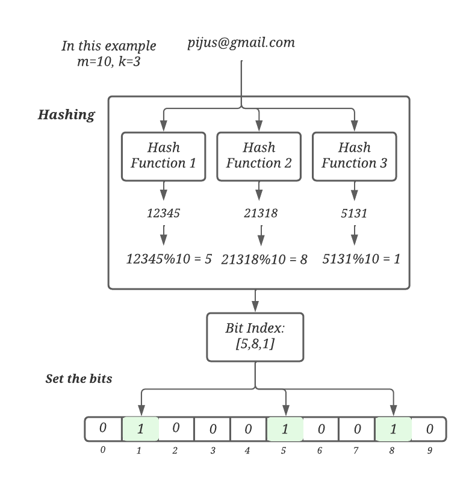
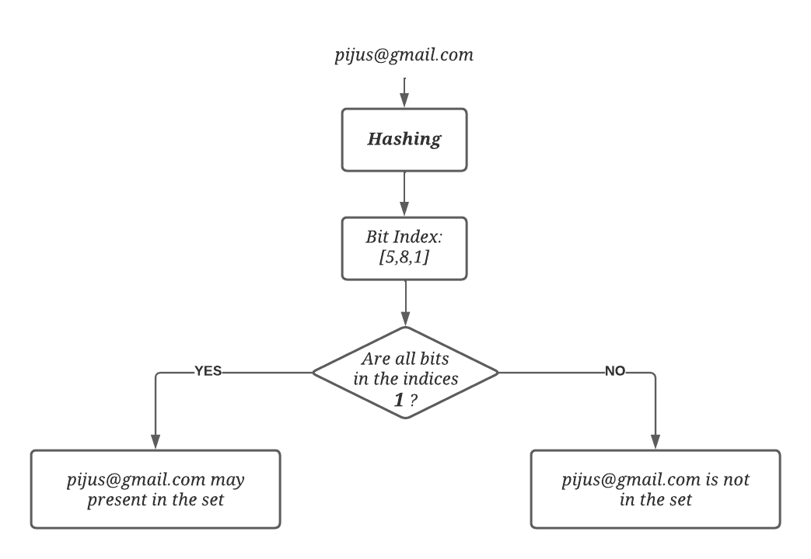

# Bloom Filter

Bloom filter is a space-efficient probabilistic data structure, that is used to test whether an element is a member of a set.
Another way we can say that Bloom filter is used to quickly find if an element might be present in a set.

False positive matches are possible, but false negatives are not – in other words, a query returns either "possibly in set" 
or "definitely not in set". Elements can be added to the set, but not removed (though this can be addressed with the 
counting Bloom filter variant); the more items added, the larger the probability of false positives.

An empty Bloom filter is a bit-array of _m_ bits, all set to _0_. 
There are also _k_ different hash functions, each of which maps a set element to one of the _m_ bit positions.

Example:
**How Bloom Filter add an item**\
In order to add an element, it must be hashed using multiple hash functions. Bits are set at the index of the hashes in the bit vector.

For example, let’s assume we need to add the pijus@gmail.com element using three efficient hash functions: 
Hash Function 1(pijus@gmail.com) = 12345 \
Hash Function 2(pijus@gmail.com) = 21318 \
Hash Function 3(pijus@gmail.com) = 5131 \

We can take the mod of 10 for all these values to get an index within the bounds of the bit vector: _12345 % 10 = 5, 21318 % 10 = 8, 5131 % 10 = 1_

**Checking membership of an item**\
For an item whose membership needs to be tested, it is also hashed via the same hash functions.
If all the bits are already set for this, the element may exist in the set.

If any bit is not set, the element is definitely not in the set.

### Usages
- Google Bigtable, Apache HBase and Apache Cassandra and PostgreSQL use Bloom filters to reduce the disk lookups for 
non-existent rows or columns. Avoiding costly disk lookups considerably increases the performance of a database query operation

