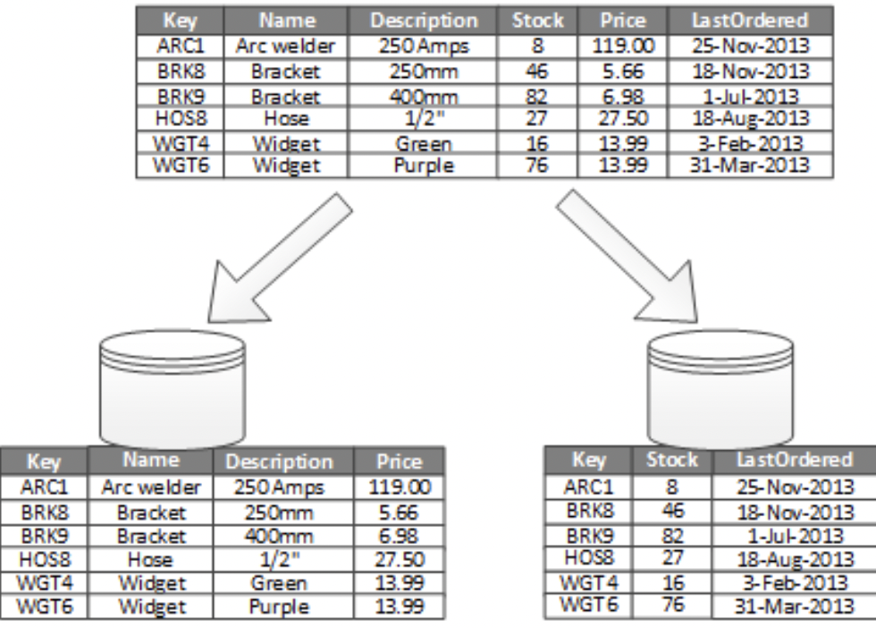

## Data Partitioning
In many large-scale solutions, data is divided into partitions that can be managed and accessed separately. 
Partitioning can improve scalability, reduce contention, and optimize performance. It can also provide a 
mechanism for dividing data by usage pattern. For example, you can archive older data in cheaper data storage.

***Why partition data?***
- **Improve scalability:** \
   When scaling up a single database system, it will eventually reach a physical hardware limit. If you 
   divide data across multiple partitions, each hosted on a separate server, you can scale out the system almost indefinitely. 
- **Improve performance:** \
  Data access operations on each partition take place over a smaller volume of data. Correctly done, partitioning can make your system more efficient. Operations that affect more than one partition can run in parallel. 
- **Improve security:** \ 
  In some cases, you can separate sensitive and nonsensitive data into different partitions and apply different security controls to the sensitive data. 
- **Provide operational flexibility:** \
  Partitioning offers many opportunities for fine-tuning operations, maximizing administrative efficiency, and minimizing cost. For example, you can define different strategies for management, monitoring, backup and restore, and other administrative tasks based on the importance of the data in each partition. 
- **Match the data store to the pattern of use:** \
  Partitioning allows each partition to be deployed on a different type of data store, based on cost and the built-in features that data store offers. For example, large binary data can be stored in blob storage, while more structured data can be held in a document database. See Choose the right data store. 
- **Improve availability:** \
  Separating data across multiple servers avoids a single point of failure. If one instance fails, only the data in that partition is unavailable. Operations on other partitions can continue. For managed PaaS data stores, this consideration is less relevant, because these services are designed with built-in redundancy.

### Partitioning criteria

**Horizontal Partitioning**:\
Horizontal partitioning is also known as **sharding**. In horizontal partitioning a table is divided into multiple smaller tables. 
Each table is a separate data store, and it contains the same number of columns, but fewer rows. 

Partitioning happens based on a key, usually we call it partitioning key or sharding key.

The most important factor is the choice of a sharding key. It can be difficult to change the key after the system is in operation. The key must ensure that data is partitioned to spread the workload as evenly as possible across the shards.

**Vertical partitioning**:\
In Vertical partitioning, some columns are moved to new tables. Each table contains the same number of rows but fewer columns. 

### Partitioning Strategies

There are five fundamental data distribution methods as basic partitioning strategies that control how data is placed into individual partitions:
1) Range Partitioning
2) Hash Partitioning
3) List Partitioning
4) Round-robin Partitioning
5) Composite Partitioning

**Range partitioning**:\
In Range partitioning, partitioning key mapped with the range which is available for partitioning. 
An example could be a partition for all rows where the "zipcode" column has a value between 70000 and 79999. 
It distributes tuples based on the value intervals (ranges) of some attribute. In addition to supporting 
exact-match queries (as in hashing), it is well-suited for range queries.
```python
key range       | partition
0 to 1000       | 1
1001 to 2000    | 2
2001 to 3000    | 3
```

**Hash partitioning**:\
Hash partitioning maps data to partitions based on a hashing algorithm to the partitioning key that you identify. 
The hashing algorithm evenly distributes rows among partitions, giving partitions approximately the same size.

Let's have en example,
For a given address we want to partition addresses based on the city. Here the partitioning key is city value.
There will be a hash function which will make sure the hash function will generate same hash value for same city.
Each hash value will have a mapping to a partition.

```python
address                     | hash          | hash value    | partition
222 John street, Toronto    | hash(Toronto) | -----23exzy   | 1
192 Sunset ave, Windsor     | hash(Windsor) | -----abc123   | 2
123 Abc Ave, Toronto        | hash(Toronto) | -----23exzy   | 1
192 XYZ Street, Windsor     | hash(Windsor) | -----abc123   | 2
```

**List Partitioning**:\
In List partitioning each partition is assigned a list of values. If the partition key has one of these values, 
the partition is chosen. Let's have an example, for the address customers, the address with that contains all the 
cities of a province, say cities of Ontario, will be in one partition and addresses that contains any city of Quebec 
will be in a different partition.

```python
Partition 1: [Barrie, Brampton, Hamilton, East York]
Partition 2: [Alma, Blainville, Boucherville, Brossard]

Address                                 | City          |  Partition
150 Manning Ave, Hamilton, ON L9A3E9    | Hamilton      |  Partition 1
99 Rue Gilles, Blainville, QC J7C3A6    | Blainville    |  Partition 2
445 Heath St E, East York, ON M4G1B6    | East York     |  Partition 1
398-250 Rue Boivin, Alma, QC G8B1Y2     | Alma          |  Partition 2 
```

**Round-robin partitioning**:\ 
Round-robin partitioning ensures uniform data distribution. With _n_ partitions, the _i-th_ tuple in insertion order is assigned to partition (_i mod n_). 
Unlike hash partitioning, it doesn't have partitioning columns.
This strategy enables the sequential access to a relation to be done in parallel. 
However, the direct access to individual tuples, based on a predicate, requires accessing the entire relation.

Let's  have a database with 3 nodes

```
Insert request 1: Insert in to node 1
Insert request 2: Insert in to node 2
Insert request 3: Insert in to node 3
Insert request 4: Insert in to node 1
Insert request 5: Insert in to node 2
```


**Composite partitioning**:\
Allows for certain combinations of the above partitioning schemes, by for example first applying 
a range partitioning and then a hash partitioning. Consistent hashing could be considered a composite 
of hash and list partitioning where the hash reduces the key space to a size that can be listed.

There are three partitioning methods:
1) Horizontal Partitioning
2) Vertical Partitioning
3) Directory Based Partitioning

**Horizontal Partitioning**\
In this method a table is divided into multiple smaller tables. Each table is a separate data store, 
and it contains the same number of columns, but fewer rows. Horizontal partitioning is widely used 
so let’s take a closer look.

**Vertical Partitioning**\
Vertical partitioning data is divided in multiple tables with same number of rows but fewer columns.
Generally, this practice is known as normalization. However, vertical partitioning extends further 
and partitions columns even when already normalized.

The most common use for vertical partitioning is to reduce the I/O and performance costs associated 
with fetching items that are frequently accessed

In this example, different properties of an item are stored in different partitions. One 
partition holds data that is accessed more frequently, including product name, description, and price. 
Another partition holds inventory data: the stock count and last-ordered date.



Other advantages of vertical partitioning:
- Relatively slow-moving data (product name, description, and price) can be separated from 
the more dynamic data (stock level and last ordered date). Slow moving data is a good candidate for an application to cache in memory.
- Sensitive data can be stored in a separate partition with additional security controls. 
- Vertical partitioning can reduce the amount of concurrent access that's needed.


**Directory Based Partitioning**:
A loosely coupled approach to work around issues mentioned in the above schemes is to create 
a lookup service which knows your current partitioning scheme and abstracts it away from the DB access code. 
So, to find out where a particular data entity resides, we query the directory server that 
holds the mapping between each tuple key to its DB server. This loosely coupled approach means we can 
perform tasks like adding servers to the DB pool or changing our partitioning scheme without 
having an impact on the application.


**Common Problems of Data Partitioning**:
On a partitioned database, there are certain extra constraints on the different operations 
that can be performed. Most of these constraints are due to the fact that operations across multiple tables or 
multiple rows in the same table will no longer run on the same server. Below are some of the constraints 
and additional complexities introduced by partitioning:

1) **Joins and Denormalization:**\
Performing joins on a database which is running on one server is straightforward, but once a database is partitioned and spread across multiple machines it is often not feasible to perform joins that span database partitions. Such joins will not be performance efficient since data has to be compiled from multiple servers. A common workaround for this problem is to denormalize the database so that queries that previously required joins can be performed from a single table. Of course, the service now has to deal with all the perils of denormalization such as data inconsistency.

2) **Referential integrity:**\
As we saw that performing a cross-partition query on a partitioned database is not feasible, similarly, trying to enforce data integrity constraints such as foreign keys in a partitioned database can be extremely difficult.\
    Most of RDBMS do not support foreign keys constraints across databases on different database servers. Which means that applications that require referential integrity on partitioned databases often have to enforce it in application code. Often in such cases, applications have to run regular SQL jobs to clean up dangling references.

3) **Rebalancing:**\
There could be many reasons we have to change our partitioning scheme:

The data distribution is not uniform, e.g., there are a lot of places for a particular ZIP code that cannot fit into one database partition.
There is a lot of load on a partition, e.g., there are too many requests being handled by the DB partition dedicated to user photos.
In such cases, either we have to create more DB partitions or have to rebalance existing partitions, which means the partitioning scheme changed and all existing data moved to new locations. Doing this without incurring downtime is extremely difficult. Using a scheme like directory based partitioning does make rebalancing a more palatable experience at the cost of increasing the complexity of the system and creating a new single point of failure (i.e. the lookup service/database).
