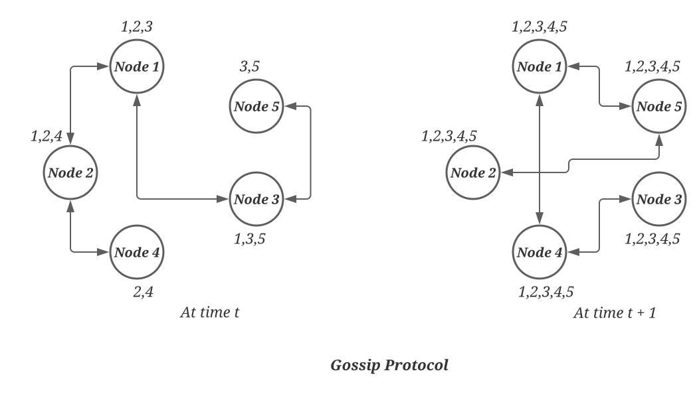

# Gossip Protocol
Gossip protocol is a communication protocol that allows state sharing in distributed systems. 
Most modern systems use this peer-to-peer protocol to disseminate information to all the members in a network or cluster.

This protocol is used in a decentralized system that does not have any central node to keep track of all nodes and 
know if a node is down or not.

**Gathering State information**:\
So, how does a node know every other node’s current state in a decentralized distributed system?

The simplest way to do this is to have every node maintain heartbeats with every other node.

When a node goes down, it stops sending out heartbeats, and everyone else finds out immediately. 
But then <i>O(N2)</i> messages get sent to every tick (_N_ being the number of nodes), 
which is an expensive operation in any sizable cluster.

**How it works?**\
The protocol enables each node to keep track of state information about the other nodes in the cluster, 
such as which nodes are reachable, what key ranges they are responsible for, and so on (this is basically 
a copy of the hash ring). Nodes share state information to stay in sync. Gossip protocol is a peer-to-peer 
communication mechanism in which nodes periodically exchange state information about themselves and other 
nodes they know about. Each node initiates a gossip round every second to exchange state information about 
itself and other nodes with one other random node. This means that any new event eventually propagates through 
the system, and all nodes quickly learn about all other nodes in a cluster.

**Seed nodes**\
The gossip protocol can result in a logical partition of the cluster in a particular scenario. Let’s understand 
this with an example:

An administrator joins node A to the ring and then joins node B to the ring. Nodes A and B consider themselves 
part of the ring, yet neither would be immediately aware of each other. To prevent these logical partitions, 
some distributed systems use the concept of seed nodes. Seed nodes are fully functional nodes and can be obtained 
either from a static configuration or a configuration service. This way, all nodes are aware of seed nodes. Each
node communicates with seed nodes through gossip protocol to reconcile membership changes. Therefore, logical 
partitions are highly unlikely.
