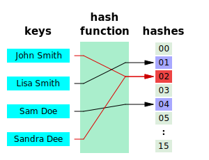

# Hashing
Hashing is a technique of generating fixed-size values, _**hash value**_, from a given data. There is a function 
associated with hashing called _**hash function**_ that generates the fixed size value based on 
mathematical algorithm. These algorithms are called _**hashing algorithm**_. 
Time complexity of reading a value from hash table is _O(1)_.

A good hash function uses a one-way hashing algorithm, or in other words, the hash cannot be converted back into the original key.

### Collisions
Hash collision is a phenomenon where hash value of two different key/data are same.
Collision is not expected and there are ways to handle hash collision.

**Chaining** is one of the method to handle hash collision.  In _Chaining_ the idea is to keep collided hash values in a _linked list_.
The drawback with this is approach is that all the overhead now comes to linked list data structure. To retrieve any specific value of a key
whose hash value is collided we have to traverse the linked list, time complexity _O(n)_. 

**Rehashing**
In Rehashing it detects if a new hash value is collided or not. If it collides then the hash will point to a spot that has something already.
If collided it hashes the given key/data again and hope to land in an open space.
This rehash can be the same function or something different. As long as the order of hashing is followed, you will get to your desired entry.

**Linear Probing**
In Linear Probing it just add 1 and go to the next position if the first hashed location is taken (collision). 
The issue with this is with high load factors it can lead to clustering which induces collisions into other collisions.

**Quadratic Probing**
This is similar to linear probing except instead of adding 1 or going to the neighboring location you add a successive values of an arbitrary 
quadratic polynomial until an open slot is found. This leads to less primary clustering.

