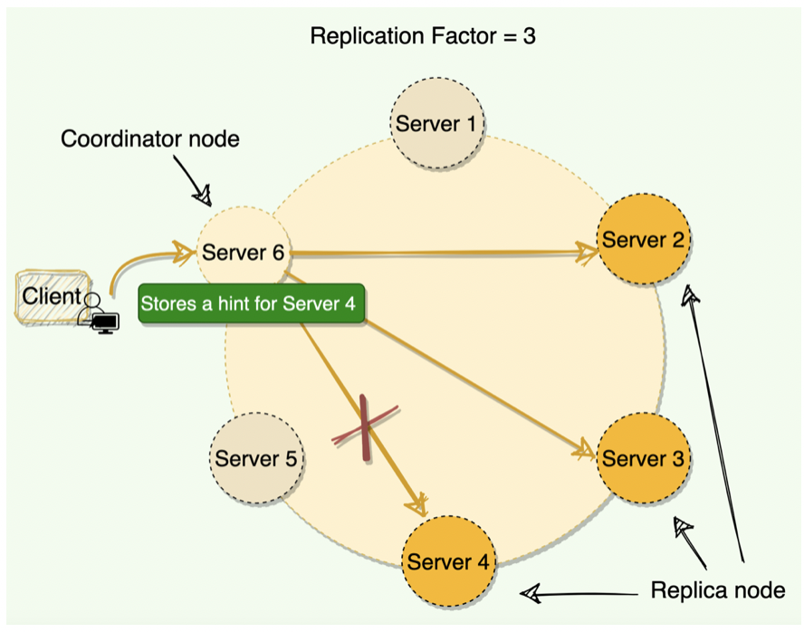

# Hinted Handoff
Hinted Handoff is an optional part of writes whose primary purpose is to provide extreme write availability when consistency is not required.
Hinted Handoff is a process that improves write throughput in distributed systems when some systems are down. When a node is down or 
does not respond to a write request, the coordinator node writes a hint in a text file on the local disk. This hint contains the 
data itself along with information about which node the data belongs to When the coordinator node discovers from the Gossiper 
(will be discussed later) that a node for which it holds hints has recovered, it forwards the write requests for each hint to the target.
Furthermore, each node every ten minutes checks to see if the failing node, for which it is holding any hints, has recovered.

Depending upon the consistency level, some distributed systems like Cassandra still serve write requests even when nodes are down. 
For example, if we have the replication factor of three and the client is writing with a quorum consistency level. 
This means that if one of the nodes is down, Cassandra can still write on the remaining two nodes to fulfill the consistency level, 
hence, making the write successful.

Hinted Handoff can reduce the time required for a temporarily failed node to become consistent again with live ones. This is especially useful when a flakey network causes false-positive failures.

### How it works?
When a distributed system accepts a write request and a replica node for the row is known to be down (see "Guarantees," below), the system (Example Cassandra, DynamoDB and others) 
will write a hint to a live replica node indicating that the write needs to be replayed to the unavailable node. 
If no replica nodes are alive for this row key, the coordinating node will write the hint (and the update itself) locally.

Once a node discovers via Gossip that a node for which it holds hints has recovered, it will send the data row corresponding to each hint to the target.

### Consistency Level
A hinted write does not count towards ConsistencyLevel requirements of `ONE, QUORUM, or ALL`. If insufficient replica targets 
are alive to sastisfy a requested ConsistencyLevel, UnavailableException will be thrown with or without Hinted Handoff. 
Suppose node **_A_** is down while we write row **_K_** to it with ConsistencyLevel.ONE. We must fail the write: recall that the ConsistencyLevel 
contract is that "reads always reflect the most recent write when `W + R > RF`, where W is the number of nodes to block for on write, 
and **_R_** the number to block for on reads."

If we wrote a hint to B and call the write good because it is written "somewhere," the contract would be violated because 
there is no way to read the data at any ConsistencyLevel until A comes back up and B forwards the data to him.

### Performance
Hinted handoff is designed to minimize the extra load on the cluster to avoid cascading failure.

There are two parts to a hinted write: _the hint_, that specifies where to replay a given row, and the data being written 
itself. Writing a hint to a replica node that is already going to store the data row is almost free: the hint will be 
included in the data row's commitlog append, and the hint itself is small compared to most data rows.

But in the worst case, if all replicas in the cluster are down, and if you are writing at CL.ANY, Hinted Handoff can 
increase the effective load on the cluster. Here's how:

Recall that cluster write throughput is directly proportional to the number of nodes N, and inversely proportional to 
the number of replicas **RF**. If a single node writes **15,000** rows per second, then you would expect a **5** node cluster 
writing **3** replicas will be roughly **_15,000 * N / RF_** or 25,000 rows/s.

Without Hinted Handoff, if you lose a node, you lose **_1/N_** of your cluster capacity but you also have to write **_1/N_** less rows, 
so there is no increase in load on the rest of the cluster. If you lose all the replicas for a range of rows, 
you lose **_RF/N_** of capacity and write **_RF/N_** less rows. But if you are writing at CL.ANY then you only reduce the write 
load by **_(RF-1)/N_**, i.e., you still have to write the hinted row to the coordinator.

### Repair
A common misunderstanding is that Hinted Handoff lets you safely get away without needing repair. This is not the case 
(as of Cassandra 0.8.x), because Hinted Handoff only happens once the failure detector has recognized that a replica is unavailable. 
That means that (for ConsistencyLevel < ALL) there is a window during which a node is dead and not accepting writes, but no hints 
are created for it.

Thus, we often say that Hinted Handoff is an optimization for consistency. Say, for instance, that you are doing reads and writes
at CL.ONE, with 3 replicas. You are thus implicitly accepting the possibility of stale reads in exchange for higher availability. 
Hinted Handoff won't change the worst case behavior--you can still see stale reads--but you will see less of them with hints enabled, 
than without.

