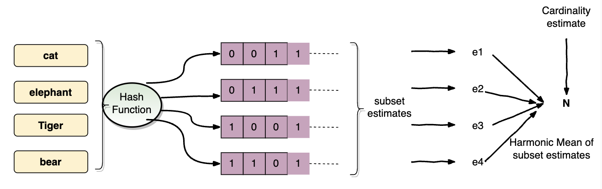

# HyperLogLog
HyperLogLog is an algorithm for the _count-distinct problem_, approximating the number of distinct elements in a multiset. 
Calculating the exact cardinality of a multiset requires an amount of memory proportional to the cardinality, which is 
impractical for very large data sets. For instance, for a set of _8_ numbers, _{4,3,6,2,2,6,1,7}_, the cardinality 
of the membership set would be 6.

HyperLogLog is most useful for large datasets, for instance, reporting the number 
of searches on Google performed by end users within a day. Trying to pull all of the searches into memory to work with 
them would be impossible because the memory required would be proportional to the number of Google searches in a day. 
HyperLogLog converts the data into a hash of random numbers representing the cardinality of the data supplied, solving 
this problem with as little as <i>1.5kB</i> of memory.

The _count-distinct_ problem is the problem of finding the number of distinct elements in a data stream with repeated elements.

The key concept behind this algorithm is that if we count the maximum number of leading zeros in the set items 
(hashed to uniform random numbers and represented in binary), we can estimate the number of unique items with a simple calculation.

If the maximum number of leading zeros is _n_, the estimated cardinality of the set is <i>2<sup>n</sup></i>.




Let's take a example and solve it with HyperLogLog algorithm.

**Problem statement:**\
The problem is the find approximate number of unique users connected to a website at a moment. 
Each user is identified by a unique `UserId`. 

**Bruteforce solution:**\
Maintain a table for user connection in database with `UserId` and `Status`, may be some other optional information like device type(mobile app, browser, timezone).

*Connections* Table

| User ID | Device | Timezone | Status | 
|---|---|---|---|
|1234|Chrome|2022-03-28T02:11:28.826Z| Active|
|1235|Mobile App|2022-03-28T02:11:28.826Z| Active|
|1236|Chrome|2022-03-28T02:11:28.826Z| Active|
|1234|Chrome|2022-03-28T02:11:28.826Z| Active|

We can used a distinct query to count unique users, 
```sql
SELECT count(distinct(User ID)) From Connections where Status='Active'
```

Considering single database with large number of users, It has to check every entry which is the number of connection.\
So if there are _n_ connection the time complexity will be _O(n)_. And also the database engine has to keep the users ids in 
a set/hash map to find all the unique users. So the space complexity will be _O(n)_ where _n_ is the number of unique users.
So the time complexity and space complexity is _O(n)_.


**Improved solution:**\
We can maintain a hash table with `User ID` as key and number of connection as value.
When there is a new connection we insert that in the connection table and increase
the counter in the hash table. At a moment the hash table size will the same as number of 
unique active user. Time complexity will be constant _O(1)_ and space complexity will be still 
_O(n)_.


Now if the data store is distributed, like you have _n_ nodes, and user is connected to multiple 
node as a moment, mobile app is connecting to one node, laptop/desktop is connected to another node.
A practical example will be something like Netflix user account. One account might have multiple profiles
and each profile may be streaming different video content which is serviced from different nodes. In this 
case we need get active user information from all the nodes.

Ideally we can't reduce the space complexity bellow _O(n)_. Now the question is if asked to find 
approximate number of active users can we optimize the space complexity.

Now it comes to **_HyperLogLog_** algorithm. It is an approximation algorithm and the search space 
has to be uniformly distributed and random. 

Consider, _User ID_ is a _64-bit_ number.

Each bit position could be either 0 or 1. So half of the number will have zero in last bit position.
Similarly, 1/4-th of the numbers will have zero in last two bit position. Now if we want _x_ consecutive 
zeros from the last then <i>2<sup>x</sup></i> numbers will have _x_ zeros in the last.


Now we store max number of zeros in the User ID from last observed so far in a node. That number 
will give us the estimation about how many active users were connected in that node.

```
User 1:   1100 
User 2:   1000  
User 3:   0001
User 1:   1100

Max number of zeros from the end = 3
Approximately 2^3=8 unique users
```

Duplicate user ids doesn't change the count. \
User ID with _64-bit_ will have _64_ zeros at max at the end. 

Total number with _64_ bit will be = <i>2<sup>64</sup></i>\
Total _7-bit_ is required to represent _64_ = <i>log<sub>2</sub>(64) = 6</i>

<i>log<sub>2</sub>(log<sub>2</sub>(2<sup>64</sup>))</i> = _6_

There was an assumption made that there is at least one _1_ after the consecutive zeros from 
the end. But if all the bits are zero then it gives a wrong count. For example:
```
bits - Zeros
1000 - 3 
1100 - 2
0000 - 4
0100 - 0

Total numbers = 2^4 = 16
But it should be 2^3 = 8
```

To solve this problem, we need to hash the user ids base on the few bits from the beginning.

```
Hash bits - Bits - Zeros
       11 - 1000 - 3 
       01 - 1100 - 2
       10 - 0000 - 4
       00 - 0100 - 2
       
(00) -> 0 - 0
(01) -> 1 - 2
(10) -> 2 - 4
(11) -> 3 - 3

Now take the average x = (2+2+4+3)/4 = 2.75
```
Total numbers = <i>2<sup>2.75</sup>= 6.727</i>, which is close to the actual count(8).


Here are the steps:
- Step 1: We will first convert the input User IDs to a set of uniformly distributed random numbers using a Hash function. The cardinality doesn’t change here as only the User IDs are converted to uniformly distributed random numbers. 
- Step 2: These random numbers are divided into different subsets using the initial few bits. The number of maximum leading zeros, within its values, are stored in memory. 
- Step 3: We calculate the harmonic mean of estimates for all the previously computed subsets. 
- Step 4: The harmonic mean computed above is an estimation of the unique visitor count on the web page.


For More on HyperLogLog read _Philippe Flajolet_ [paper](http://algo.inria.fr/flajolet/Publications/FlFuGaMe07.pdf).
