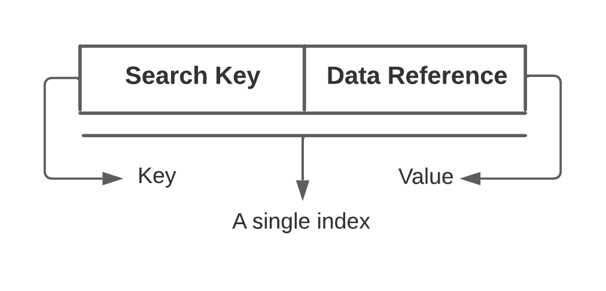

### Index Table
Indexing is a way to optimize the performance of a database by minimizing the number of disk accesses required when a query is processed. 
It is a data structure technique which is used to quickly locate and access the data in a database. 

Indexes are created using some database columns. 
- The first column is the Search key that contains a copy of the primary key or candidate key of the table.
- The second column is the Data Reference which contains a set of pointers holding the address of the disk block where that particular key value can be found.

In general, there are two types of file organization mechanism which are followed 
by the indexing methods to store the data:  
1. Sequential File Organization or Ordered Index File: \
   In this, the indices are based on a sorted ordering of the values. These are generally fast and a more traditional type of storing mechanism. These Ordered or Sequential file organization might store the data in a dense or sparse format: 
   - Dense Index: 
     - For every search key value in the data file, there is an index record. 
     - This record contains the search key and also a reference to the first data record with that search key value.
   - Sparse Index:
     - The index record appears only for a few items in the data file. Each item points to a block as shown. 
     - To locate a record, we find the index record with the largest search key value less than or equal to the search key value we are looking for. 
     - We start at that record pointed to by the index record, and proceed along with the pointers in the file (that is, sequentially) until we find the desired record.
   
2. Hash File organization: \
   Indices are based on the values being distributed uniformly across a range of buckets. 
   The buckets to which a value is assigned is determined by a function called a hash function.\
   There are primarily three methods of indexing:
   - Clustered Indexing
   - Non-Clustered or Secondary Indexing
   - Multilevel Indexing
 

Create indexes over the fields in data stores that are frequently referenced by queries.
An index table organizes the data by a specified key.  

Many data stores organize the data for a collection of  entities using the primary key.
While the primary key is valuable for queries that fetch data based on the value 
of this key, an application might not be able to use the primary key if it needs to 
retrieve data based on some other field.

In the above example customer ID is the primary key, if the query needs to get customers based on 
the city then it won't be possible based on the current table. To support that we need a secondary index. 

Many relational database management systems support _secondary indexes_. A _secondary index_ 
is a separate data structure that's organized by one or more non-primary (secondary) key fields, 
and it indicates where the data for each indexed value is stored. 

An application can use this key to locate and retrieve data.

Three strategies are commonly used for structuring an index table
1) Duplicate the data in each index table but organize it by different keys.
2) Create normalized index tables organized by different keys and reference the original data by using the primary key rather than duplicating it.\
   This technique saves space and reduces the overhead of maintaining duplicate data. The disadvantage is that an application has to perform two lookup operations to find data using a secondary key. It has to find the primary key for the data in the index table, and then use the primary key to look up the data in the fact table
3) Create partially normalized index tables organized by different keys that duplicate frequently retrieved fields. Reference the fact table to access less frequently accessed fields.