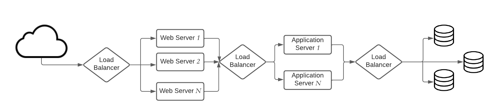

## Load Balancing
Load Balancers are designed to share the load between available resources that serves the load.
Load Balancers distributes/shares/spread incoming traffic across a cluster of resources to improve 
responsiveness and availability. 

Load balancers maintains state/status of all the resources while distributing requests. If any resource 
is not responding or takes more time than usual the Load balancer increase the error rate 
of that specific resource and reduce traffic forwarding to that resource. Load balance can be 
used between any two points where we need to share the load. Here is an example of load balancer.

Load balancing algorithms are primarily divided in two types: 
- *Dynamic load balancing* algorithms maintains current state of the resources and distribute traffic accordingly.
- *Static load balancing* algorithms distributes traffic based on a fixed/static schema/plan. 

#### Static load balancing algorithms
1) ***Round Robin***:\
Round robin algorithm cycles through a list of servers and sends each new request to the next server. 
When it reaches the end of the list, it starts over at the beginning. It is most useful when the servers are of equal 
specification and there are not many persistent connections.
2) ***Weighted Round Robin***:\
This algorithms allows weights associated with each resource. Like servers deemed able to handle more traffic 
will receive slightly more. Weighting can be configured within DNS records.
3) ***IP hash***:\
Combines incoming traffic's source and destination IP addresses and uses a mathematical function to convert it into a hash. 
Based on the hash, the connection is assigned to a specific server.

#### Dynamic load balancing algorithms
1) ***Least Connection***:\ 
This algorithm directs traffic to the server with the fewest active connections. This approach is quite useful 
when there are a large number of persistent client connections which are unevenly distributed between the servers.
2) ***Weighted Least Connection***\
Weighted Least Connection is build on the least connection. This algorithm provides administrators the ability to 
assign different weights to each server, assuming that some servers can handle more connections than others.
3) ***Weighted Response Time***:\
Weighted Response Time is a load balancing algorithm where the response times of the application 
servers determines which application server receives the next request. The application server response time 
to a health check is used to calculate the application server weights. The application server that is 
responding the fastest receives the next request.
4) ***Resource-based***:\
Distributes load based on what resources each server has available at the time. Specialized software, called an "agent", 
running on each server measures that server's available CPU and memory, and the load balancer queries the agent 
before distributing traffic to that server.

Load balancer is also a place of single point of failure, So the idea is to use more than one 
load balancers. Now consider like your load balancers are in `one physical unit`, 
`one physical unit` means load balancers may be in one physical machine/one data center/a cluster of cloud instances/a region.
If that one unit is down due to any reason, like power supply, natural disaster, your load balancers are gone. 

In this case there is a strategy of mapping DNS name with multiple server. If someone hit the your domain
It will try one of the assigned serves to forward the requests. These initial stage of serves are the 
load balancers. Here is an example:

