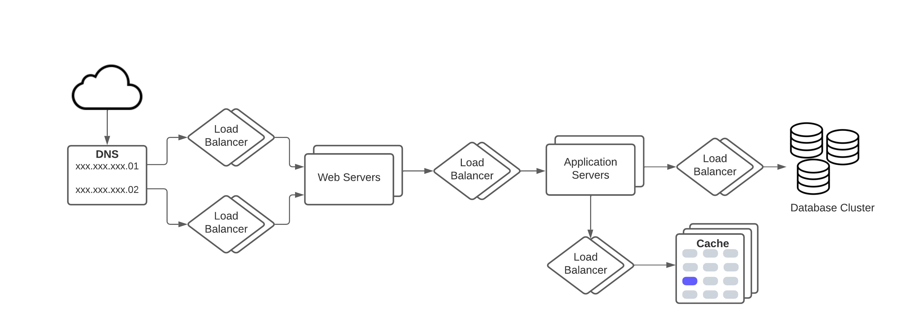

# System Design
This is a high-level overview of some components which are important for scalable and distributed system design, and some sample 
system design examples.

# Table of Content 
- Important keywords/methods/process
  - [Load Balancing](#load-balancing)
    - [Dynamic load balancing algorithms](#dynamic-load-balancing-algorithms)
    - [Static load balancing algorithms](#static-load-balancing-algorithms)
    - Load balancing based on layers
  - [Caching](#caching)
  - [Data Partitioning](#data-partitioning)
    - [Partitioning criteria](#partitioning-criteria)
    - [Partitioning Strategies](#partitioning-strategies)
  - Indexes
  - Proxies
  - Replication 
  - Fault Tolerance
  - CAP Theorem
  - PACELC Theorem
  - Hashing
  - Consistent Hashing
  - Long-Polling
  - WebSocket
  - Bloom filter
  - Quorum
  - Leader & Follower
  - Heartbeat
  - Checksum
  - Write-Ahead-Log (WAL)
  - Segmented Log
  - Hyperloglog
  - High-Water Mark
  - Lease
  - Gossip Protocol
  - Phi Accrual Failure Detection
  - Split Brain
  - Fencing 
  - Vector Clocks 
  - Hinted Handoff 
  - Read Repair 
  - Merkle Trees
  - Metadata
  - Compaction 
  - SSL passthrough / termination on load balancers 
  - Two phase commit 
  - Two phase locking 
  - Total order broadcast 
  - Isolation levels (read uncomitted, read comitted, repeatable read, serializable)
  - Quadtree (GeoHashin)
  - Inverse indexing - Google search/any search indexing 
  - Gaming ranking - rank players based on score and faster. 
  - Paxos algo 
  - Raft 
  - Backpressure 
  - Circuit breaker
  - Service discovery 
  - Saga
  - Frugal Streaming - https://github.com/resumejob/system-design-algorithms
  - Geohash / S2 Geometry
  - Leaky bucket / Token bucket
  - Lossy Counting 
  - Operational transformation
  - Ray casting 
  - Reverse index 
  - Rsync algorithm 
  - Trie algorithm 
  - Fenwick Tree
- [Selected System Designs](./solutions/README.md)
    - [Design a chat messenger, like Facebook chat or Whatsapp](./solutions/CHAT_MESSENGER_DESIGN.md)
- [System organization](./SystemOrganization.md)


## Load Balancing
Load Balancers are designed to share the load between available resources that serves the load.
Load Balancers distributes/shares/spread incoming traffic across a cluster of resources to improve 
responsiveness and availability. 

Load balancers maintains state/status of all the resources while distributing requests. If any resource 
is not responding or takes more time than usual the Load balancer increase the error rate 
of that specific resource and reduce traffic forwarding to that resource. Load balance can be 
used between any two points where we need to share the load. Here is an example of load balancer.


Load balancing algorithms are primarily divided in two types: 
- *Dynamic load balancing* algorithms maintains current state of the resources and distribute traffic accordingly.
- *Static load balancing* algorithms distributes traffic based on a fixed/static schema/plan. 

#### Static load balancing algorithms
1) ***Round Robin***:\
Round robin algorithm cycles through a list of servers and sends each new request to the next server. 
When it reaches the end of the list, it starts over at the beginning. It is most useful when the servers are of equal 
specification and there are not many persistent connections.
2) ***Weighted Round Robin***:\
This algorithms allows weights associated with each resource. Like servers deemed able to handle more traffic 
will receive slightly more. Weighting can be configured within DNS records.
3) ***IP hash***:\
Combines incoming traffic's source and destination IP addresses and uses a mathematical function to convert it into a hash. 
Based on the hash, the connection is assigned to a specific server.

#### Dynamic load balancing algorithms
1) ***Least Connection***:\ 
This algorithm directs traffic to the server with the fewest active connections. This approach is quite useful 
when there are a large number of persistent client connections which are unevenly distributed between the servers.
2) ***Weighted Least Connection***\
Weighted Least Connection is build on the least connection. This algorithm provides administrators the ability to 
assign different weights to each server, assuming that some servers can handle more connections than others.
3) ***Weighted Response Time***:\
Weighted Response Time is a load balancing algorithm where the response times of the application 
servers determines which application server receives the next request. The application server response time 
to a health check is used to calculate the application server weights. The application server that is 
responding the fastest receives the next request.
4) ***Resource-based***:\
Distributes load based on what resources each server has available at the time. Specialized software, called an "agent", 
running on each server measures that server's available CPU and memory, and the load balancer queries the agent 
before distributing traffic to that server.


Load balancer is also a place of single point of failure, So the idea is to use more than one 
load balancers. Now consider like your load balancers are in `one physical unit`, 
`one physical unit` means load balancers may be in one physical machine/one data center/a cluster of cloud instances/a region.
If that one unit is down due to any reason, like power supply, natural disaster, your load balancers are gone. 

In this case there is a strategy of mapping DNS name with multiple server. If someone hit the your domain
It will try one of the assigned serves to forward the requests. These initial stage of serves are the 
load balancers. Here is an example:



## Caching
Caching is a technique that stores a copy of frequently used data to fast storage that's located close to the application.
Caching is used to improve performance and scalability of a system.

Caching is most efficient for read heavy information, especially if all the following condition apply to the original data store
- data is relatively static, means update is not that frequent
- Reading data from original storage is slower than reading from caching store
- It's subject to a high level of contention
- It's far away when network latency can cause access to be slow


Based on the nature of the application/service architecture there are different ways of caching. In <u>distributed
applications</u> there are two strategies:
1) Private caching: In private caching data is held locally in the machine where the application is running. Mostly used in
   in-memory to store the cache. Expecting the cache data size to be smaller, not highly increasing over time. 
2) Shared caching: In shared caching a common source that can be accessed by multiple processes and machines. 
   Multiple application can read/write to same cache, it's little slower than private caching. Considering the cache store
   is in-memory but there will be some time for network call as the shared cache store is not local to the app machine.


Caching is a temporary storage, it may store data for longer period of time but it is not a persistent service/storage.
So it will be safe to store important data that you can afford to lose in persistent storage.\
For dynamic data, data that changes frequently caching is not that useful. If actual/original data changes too frequently
then either the cache becomes stale/old quickly or the overhead of synchronizing the cache with original data store 
reduces the effectiveness of caching.

**Cache hit:**
A _cache hit_ means the data required to serve request is available in the cache and served from the cache.

**Cache miss:** 
A _cache miss_ means the data required to serve requests is not available in the cache and need to compute/get/retrieve
from original datastore/service/server.


**Do we cache all data ?**
Mostly we don't cache all data of an entity at a time. Means, most frequently used data is cached. Data may loaded in caching
store iteratively, just before or as needed. For example, It doesn't make sence to keep all the message, pictures, posts of a 
social network user in cache, rather store the mostly used information, like, profile picture and other identity related information.

#### Caching strategies
### Cache Aside
In cache aside pattern data is loaded in to cache from data store on demand. This can improve performance and also helps 
to maintain consistency between data held in the cache and data in the underlying data store.

Process:
- On receiving request to serve any data, It first determine whether the data is currently available in the cache.
- If the item is not currently available in cache, read the data from the original data store.
- Store a copy of the item in the cache.

### Write through cache
In _Write through cache_, all the write/update happens in the cache first and then to the orginal data store. 
The cache has a writer component that can write to data store/database.
- The application receives request to write data to data store/database.
- The application writes the data to the cache.
- The cache invokes the writer to write to database as well as update the cache.


### Read through cache
In _Read through cache_ strategy, the cache contains a component that can load or read data from 
original data store/database.

- When the application receives the read request, it asks the cache for data associated with the key.
- If requested data found in the cache, cache hit, then the data is served from the cache.
- If requested data is not available/old/outdated in the cache, cache miss, then the cache invokes the loader 
   that fetches the data from the database, updates the cache, and serves the fetched data.
- The next time there is a read request for the same data, it’s served from the cache.

### Write back cache
This strategy is similar to [Write through cache](#write-through-cache) with the change that 
write to original datastore is not synchronous, cache service writes the data to datastore asynchronously.

- The application send write request to the caching server
- The cache server writes data to the cache, also keep the data in a buffer/queue to write to original database,
- The cache server send an acknowledgement back to the application after writing the data cache and buffer. At this 
point write to original database didn't happen.
- The cache internally maintains a buffer to save the writes.
- The cache asynchronously writes the data from the buffer to the database at a later point in time.

## Data Partitioning
In many large-scale solutions, data is divided into partitions that can be managed and accessed separately. 
Partitioning can improve scalability, reduce contention, and optimize performance. It can also provide a 
mechanism for dividing data by usage pattern. For example, you can archive older data in cheaper data storage.

***Why partition data?***
- **Improve scalability:** \
   When scaling up a single database system, it will eventually reach a physical hardware limit. If you 
   divide data across multiple partitions, each hosted on a separate server, you can scale out the system almost indefinitely. 
- **Improve performance:** \
  Data access operations on each partition take place over a smaller volume of data. Correctly done, partitioning can make your system more efficient. Operations that affect more than one partition can run in parallel. 
- **Improve security:** \ 
  In some cases, you can separate sensitive and nonsensitive data into different partitions and apply different security controls to the sensitive data. 
- **Provide operational flexibility:** \
  Partitioning offers many opportunities for fine-tuning operations, maximizing administrative efficiency, and minimizing cost. For example, you can define different strategies for management, monitoring, backup and restore, and other administrative tasks based on the importance of the data in each partition. 
- **Match the data store to the pattern of use:** \
  Partitioning allows each partition to be deployed on a different type of data store, based on cost and the built-in features that data store offers. For example, large binary data can be stored in blob storage, while more structured data can be held in a document database. See Choose the right data store. 
- **Improve availability:** \
  Separating data across multiple servers avoids a single point of failure. If one instance fails, only the data in that partition is unavailable. Operations on other partitions can continue. For managed PaaS data stores, this consideration is less relevant, because these services are designed with built-in redundancy.

### Partitioning criteria

**Horizontal Partitioning**:\
Horizontal partitioning is also known as **sharding**. In horizontal partitioning a table is divided into multiple smaller tables. 
Each table is a separate data store, and it contains the same number of columns, but fewer rows. 

Partitioning happens based on a key, usually we call it partitioning key or sharding key.

The most important factor is the choice of a sharding key. It can be difficult to change the key after the system is in operation. The key must ensure that data is partitioned to spread the workload as evenly as possible across the shards.

**Vertical partitioning**:\
In Vertical partitioning, some columns are moved to new tables. Each table contains the same number of rows but fewer columns. 

### Partitioning Strategies

There are five fundamental data distribution methods as basic partitioning strategies that control how data is placed into individual partitions:
1) Range
2) Hash
3) List
4) Round-robin
5) Composite

**Range base partitioning**:\
In Range base partitioning, partitioning key mapped with the range which is available for partitioning. 
An example could be a partition for all rows where the "zipcode" column has a value between 70000 and 79999. 
It distributes tuples based on the value intervals (ranges) of some attribute. In addition to supporting 
exact-match queries (as in hashing), it is well-suited for range queries.
```python
key range       | partition
0 to 1000       | 1
1001 to 2000    | 2
2001 to 3000    | 3
```

**Hash base partitioning**:\
Hash partitioning maps data to partitions based on a hashing algorithm to the partitioning key that you identify. 
The hashing algorithm evenly distributes rows among partitions, giving partitions approximately the same size.

Lets have en example,
For a given address we want to partition addresses based on the city. Here the partitioning key is city value.
There will be a hash function which will make sure the hash function will generate same hash value for same city.
Each hash value will have a mapping to a partition.

```python
address                     | hash          | hash value    | partition
222 John street, Toronto    | hash(Toronto) | -----23exzy   | 1
192 Sunset ave, Windsor     | hash(Windsor) | -----abc123   | 2
123 Abc Ave, Toronto        | hash(Toronto) | -----23exzy   | 1
192 XYZ Street, Windsor     | hash(Windsor) | -----abc123   | 2
```

**List Partitioning**:\
In List partitioning each partition is assigned a list of values. If the partition key has one of these values, 
the partition is chosen. Let's have an example, for the address customers, the address with that contains all the 
cities of a province, say cities of Ontario, will be in one partition and addresses that contains any city of Quebec 
will be in a different partition.

```python
Partition 1: [Barrie, Brampton, Hamilton, East York]
Partition 2: [Alma, Blainville, Boucherville, Brossard]

Address                                 | City          |  Partition
150 Manning Ave, Hamilton, ON L9A3E9    | Hamilton      |  Partition 1
99 Rue Gilles, Blainville, QC J7C3A6    | Blainville    |  Partition 2
445 Heath St E, East York, ON M4G1B6    | East York     |  Partition 1
398-250 Rue Boivin, Alma, QC G8B1Y2     | Alma          |  Partition 2 
```

**Round-robin partitioning**:\ 
Round-robin partitioning ensures uniform data distribution. With _n_ partitions, the _i-th_ tuple in insertion order is assigned to partition (_i mod n_). 
Unlike hash partitioning, it doesn't have partitioning columns.
This strategy enables the sequential access to a relation to be done in parallel. 
However, the direct access to individual tuples, based on a predicate, requires accessing the entire relation.

Let's  have a database with 3 nodes

```
Insert request 1: Insert in to node 1
Insert request 2: Insert in to node 2
Insert request 3: Insert in to node 3
Insert request 4: Insert in to node 1
Insert request 5: Insert in to node 2
```


**Composite partitioning**:\
Allows for certain combinations of the above partitioning schemes, by for example first applying 
a range partitioning and then a hash partitioning. Consistent hashing could be considered a composite 
of hash and list partitioning where the hash reduces the key space to a size that can be listed.


**Reference**\
The content is mostly by the @author and mixture of contents from [Wikipedia](https://en.wikipedia.org/), [Medium](https://medium.com/), [System Design Primer](https://github.com/donnemartin/system-design-primer), [Microsoft technical documentation](https://docs.microsoft.com/en-ca/) and some random blogs.


