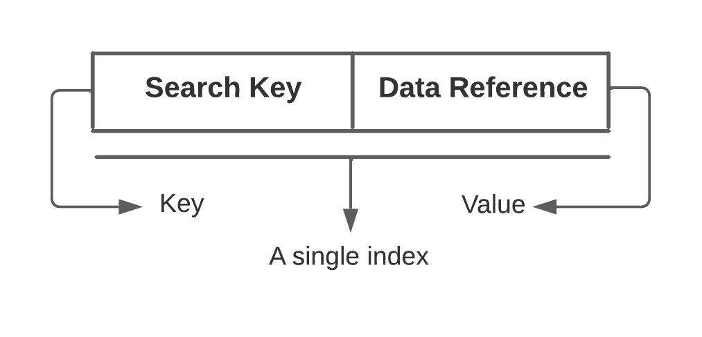

# System Design
This is a high-level overview of some components which are important for scalable and distributed system design, and some sample 
system design examples.

# Table of Content 
- [Selected System Designs](./solutions/README.md)
    - [Design a chat messenger, like Facebook chat or Whatsapp](./solutions/CHAT_MESSENGER_DESIGN.md)
    - [Design a code deployment system](./solutions/Code_Deployment_System.md)
- Important keywords/methods/process
  - [Load Balancing](#load-balancing)
    - [Dynamic load balancing algorithms](#dynamic-load-balancing-algorithms)
    - [Static load balancing algorithms](#static-load-balancing-algorithms)
    - Load balancing based on layers
  - [Caching](#caching)
  - [Data Partitioning](#data-partitioning)
    - [Partitioning criteria](#partitioning-criteria)
    - [Partitioning Strategies](#partitioning-strategies)
  - [Index Table](#index-table)
  - [Proxies](#proxies)
  - [API Gateway](#api-gateway)
  - [Hashing](./Hashing.md)
  - [Consistent Hashing](./ConsistentHashing.md)
  - [CAP Theorem](./CAP-Theorem.md)
  - [PACELC Theorem](./PACELC-Theorem.md)
  - [Replication](./Replication.md)
  - Fault Tolerance
  - Long-Polling
  - WebSocket
  - Bloom filter
  - Quorum
  - Leader & Follower
  - Heartbeat
  - Checksum
  - [Write-Ahead-Log](#write-ahead-log)
  - [Segmented Log](#segmented-log)
  - Hyperloglog
  - High-Water Mark
  - Lease
  - Gossip Protocol
  - Phi Accrual Failure Detection
  - Split Brain
  - Fencing 
  - Vector Clocks 
  - Hinted Handoff 
  - Read Repair 
  - Merkle Trees
  - Metadata
  - Compaction 
  - SSL passthrough / termination on load balancers 
  - Two phase commit 
  - Two phase locking 
  - Total order broadcast 
  - Isolation levels (read uncomitted, read comitted, repeatable read, serializable)
  - Quadtree (GeoHashin)
  - Inverse indexing - Google search/any search indexing 
  - Gaming ranking - rank players based on score and faster. 
  - Consistent Core
  - Paxos algo 
  - Raft 
  - Backpressure 
  - Circuit breaker
  - Service discovery 
  - Saga
  - Frugal Streaming - https://github.com/resumejob/system-design-algorithms
  - Geohash / S2 Geometry
  - Leaky bucket / Token bucket
  - Lossy Counting 
  - Operational transformation
  - Ray casting 
  - Reverse index 
  - Rsync algorithm 
  - Trie algorithm 
  - Fenwick Tree
- [System organization](./SystemOrganization.md)

## Load Balancing
Load Balancers are designed to share the load between available resources that serves the load.
Load Balancers distributes/shares/spread incoming traffic across a cluster of resources to improve 
responsiveness and availability. 

Load balancers maintains state/status of all the resources while distributing requests. If any resource 
is not responding or takes more time than usual the Load balancer increase the error rate 
of that specific resource and reduce traffic forwarding to that resource.

[More on Load Balancing](./LoadBalancing.md)

## Caching
Caching is a technique that stores a copy of frequently used data to fast storage that's located close to the application.
Caching is used to improve performance and scalability of a system.

Caching is most efficient for read heavy information, especially if all the following condition apply to the original data store
- data is relatively static, means update is not that frequent
- Reading data from original storage is slower than reading from caching store
- It's subject to a high level of contention
- It's far away when network latency can cause access to be slow

[More on Caching](./Caching.md)

## Data Partitioning
In many large-scale solutions, data is divided into partitions that can be managed and accessed separately. 
Partitioning can improve scalability, reduce contention, and optimize performance. It can also provide a 
mechanism for dividing data by usage pattern. For example, you can archive older data in cheaper data storage.

There are two mostly used partitioning methods, Horizontal Partitioning and Vertical Partitioning. 
***Why partition data?***
- **Improve scalability:** \
   When scaling up a single database system, it will eventually reach a physical hardware limit. If you 
   divide data across multiple partitions, each hosted on a separate server, you can scale out the system almost indefinitely. 
- **Improve performance:** \
  Data access operations on each partition take place over a smaller volume of data. Correctly done, partitioning can make your system more efficient. Operations that affect more than one partition can run in parallel. 
- **Improve security:** \ 
  In some cases, you can separate sensitive and nonsensitive data into different partitions and apply different security controls to the sensitive data. 
- **Provide operational flexibility:** \
  Partitioning offers many opportunities for fine-tuning operations, maximizing administrative efficiency, and minimizing cost. For example, you can define different strategies for management, monitoring, backup and restore, and other administrative tasks based on the importance of the data in each partition. 
- **Match the data store to the pattern of use:** \
  Partitioning allows each partition to be deployed on a different type of data store, based on cost and the built-in features that data store offers. For example, large binary data can be stored in blob storage, while more structured data can be held in a document database. See Choose the right data store. 
- **Improve availability:** \
  Separating data across multiple servers avoids a single point of failure. If one instance fails, only the data in that partition is unavailable. Operations on other partitions can continue. For managed PaaS data stores, this consideration is less relevant, because these services are designed with built-in redundancy.

[More on Data Partitioning](./DataPartitioning.md)

### Index Table
Indexing is a way to optimize the performance of a database by minimizing the number of disk accesses required when a query is processed. 
It is a data structure technique which is used to quickly locate and access the data in a database. 

Indexes are created using some database columns. 
- The first column is the Search key that contains a copy of the primary key or candidate key of the table.
- The second column is the Data Reference which contains a set of pointers holding the address of the disk block where that particular key value can be found.

[More on Index Table](./IndexTable.md)

### Write-Ahead-Log
Machines can fail or restart anytime. If a program is in the middle of performing a data modification, 
what will happen when the machine it is running on loses power? When the machine restarts, the program
might need to know the last thing it was doing. Based on its atomicity and durability needs, the program 
might need to decide to redo or undo or finish what it had started. How can the program know what it was 
doing before the system crash?

To guarantee durability and data integrity, each modification to the system is first written to an append-only log on the disk. 
This log is known as Write-Ahead Log (WAL) or transaction log or commit log
Writing to the WAL guarantees that if the machine crashes, the system will be able to recover and reapply the operation if necessary.
The key idea behind the WAL is that all modifications before they are applied to the system are first written to a log file on the disk. 
Each log entry should contain enough information to redo or undo the modification. The log can be read on every restart to recover 
the previous state by replaying all the log entries.

[More on Write-Ahead-Log](./Write-Ahead-Log.md)

### Segmented Log
Segmented Log is a method of maintaining multiple smaller log files instead of a single large file for easier operations.
A single log can become difficult to manage. As the file grows, it can also become a performance bottleneck, especially 
when it is read at the startup. Older logs need to be cleaned up periodically or, in some cases, merged. Doing these 
operations on a single large file is difficult to implement.

[More on Segmented Log](./SegmentedLog.md)

### Proxies

A proxy server is an intermediate server between the client and the back-end server. 
Clients connect to proxy servers to make a request for a service like a web page, file, connection, etc. 
In short, a proxy server is a piece of software or hardware that acts as an intermediary for requests from clients seeking 
resources from other servers.

Typically, proxies are used to filter requests, log requests, Cache, Batch requests, Collapsed forwarding and Security.

[More on Proxies](./Proxies.md)

### API Gateway
An API gateway is an API management tool that sits between a client and a collection of backend services.

An API gateway is a layer 7 (HTTP) router that acts as a reverse proxy to accept all API calls, aggregate the various services required 
to fulfill them, and return the appropriate result.

With an API gateway, one simply exposes and scales a single collection of services (the API gateway) and updates the API gateway’s 
configuration whenever a new upstream should be exposed externally.

[More on API Gateway](./APIGateway.md)

**Reference**\
The content is mostly by the @author and mixture of contents from [Wikipedia](https://en.wikipedia.org/), [Medium](https://medium.com/), [System Design Primer](https://github.com/donnemartin/system-design-primer), [Microsoft technical documentation](https://docs.microsoft.com/en-ca/) and some random blogs.

[Used references](./References.txt)