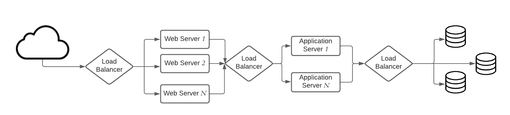
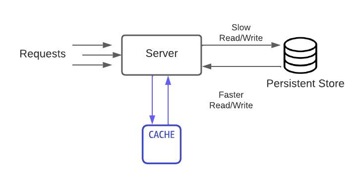
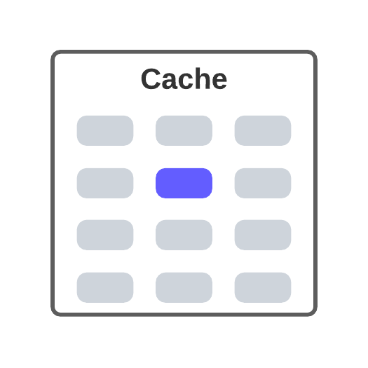
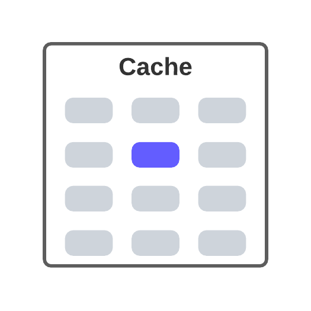

# System Design
This is a high-level overview of some components which are important for scalable and distributed system design, and some sample 
system design examples.

# Table of Content 
- Important keywords/methods/process
  - [Load Balancing](#load-balancing)
    - [Dynamic load balancing algorithms](#dynamic-load-balancing-algorithms)
    - [Static load balancing algorithms](#static-load-balancing-algorithms)
    - Load balancing based on layers
  - [Caching](#caching)
  - Data Partitioning
  - Indexes
  - Proxies
  - Replication 
  - Fault Tolerance
  - CAP Theorem
  - PACELC Theorem
  - Hashing
  - Consistent Hashing
  - Long-Polling
  - WebSocket
  - Bloom filter
  - Quorum
  - Leader & Follower
  - Heartbeat
  - Checksum
  - Write-Ahead-Log (WAL)
  - Segmented Log
  - Hyperloglog
  - High-Water Mark
  - Lease
  - Gossip Protocol
  - Phi Accrual Failure Detection
  - Split Brain
  - Fencing 
  - Vector Clocks 
  - Hinted Handoff 
  - Read Repair 
  - Merkle Trees
  - Metadata
  - Compaction 
  - SSL passthrough / termination on load balancers 
  - Two phase commit 
  - Two phase locking 
  - Total order broadcast 
  - Isolation levels (read uncomitted, read comitted, repeatable read, serializable)
  - Quadtree (GeoHashin)
  - Inverse indexing - Google search/any search indexing 
  - Gaming ranking - rank players based on score and faster. 
  - Paxos algo 
  - Raft 
  - Backpressure 
  - Circuit breaker
  - Service discovery 
  - Saga
  - Frugal Streaming - https://github.com/resumejob/system-design-algorithms
  - Geohash / S2 Geometry
  - Leaky bucket / Token bucket
  - Lossy Counting 
  - Operational transformation
  - Ray casting 
  - Reverse index 
  - Rsync algorithm 
  - Trie algorithm 
  - Fenwick Tree
- [Selected System Designs](./solutions/README.md)
    - [Design a chat messenger, like Facebook chat or Whatsapp](./solutions/CHAT_MESSENGER_DESIGN.md)
- [System organization](./SystemOrganization.md)

## Load Balancing
Load Balancers are designed to share the load between available resources that serves the load.
Load Balancers distributes/shares/spread incoming traffic across a cluster of resources to improve 
responsiveness and availability. 

Load balancers maintains state/status of all the resources while distributing requests. If any resource 
is not responding or takes more time than usual the Load balancer increase the error rate 
of that specific resource and reduce traffic forwarding to that resource. Load balance can be 
used between any two points where we need to share the load. Here is an example of load balancer.

Load balancing algorithms are primarily divided in two types: 
- *Dynamic load balancing* algorithms maintains current state of the resources and distribute traffic accordingly.
- *Static load balancing* algorithms distributes traffic based on a fixed/static schema/plan. 

#### Static load balancing algorithms
1) ***Round Robin***:\
Round robin algorithm cycles through a list of servers and sends each new request to the next server. 
When it reaches the end of the list, it starts over at the beginning. It is most useful when the servers are of equal 
specification and there are not many persistent connections.
2) ***Weighted Round Robin***:\
This algorithms allows weights associated with each resource. Like servers deemed able to handle more traffic 
will receive slightly more. Weighting can be configured within DNS records.
3) ***IP hash***:\
Combines incoming traffic's source and destination IP addresses and uses a mathematical function to convert it into a hash. 
Based on the hash, the connection is assigned to a specific server.

#### Dynamic load balancing algorithms
1) ***Least Connection***:\ 
This algorithm directs traffic to the server with the fewest active connections. This approach is quite useful 
when there are a large number of persistent client connections which are unevenly distributed between the servers.
2) ***Weighted Least Connection***\
Weighted Least Connection is build on the least connection. This algorithm provides administrators the ability to 
assign different weights to each server, assuming that some servers can handle more connections than others.
3) ***Weighted Response Time***:\
Weighted Response Time is a load balancing algorithm where the response times of the application 
servers determines which application server receives the next request. The application server response time 
to a health check is used to calculate the application server weights. The application server that is 
responding the fastest receives the next request.
4) ***Resource-based***:\
Distributes load based on what resources each server has available at the time. Specialized software, called an "agent", 
running on each server measures that server's available CPU and memory, and the load balancer queries the agent 
before distributing traffic to that server.

## Caching
Caching is a technique that stores a copy of frequently used data to fast storage that's located close to the application.
Caching is used to improve performance and scalability of a system.

Caching is most efficient for read heavy information, especially if all the following condition apply to the original data store
- data is relatively static, means update is not that frequent
- Reading data from original storage is slower than reading from caching store
- It's subject to a high level of contention
- It's far away when network latency can cause access to be slow

Based on the nature of the application/service architecture there are different ways of caching. In <u>distributed
applications</u> there are two strategies:
1) Private caching: In private caching data is held locally in the machine where the application is running. Mostly used in
   in-memory to store the cache. Expecting the cache data size to be smaller, not highly increasing over time. 
2) Shared caching: In shared caching a common source that can be accessed by multiple processes and machines. 
   Multiple application can read/write to same cache, it's little slower than private caching. Considering the cache store
   is in-memory but there will be some time for network call as the shared cache store is not local to the app machine.

Caching is a temporary storage, it may store data for longer period of time but it is not a persistent service/storage.
So it will be safe to store important data that you can afford to lose in persistent storage.\
For dynamic data, data that changes frequently caching is not that useful. If actual/original data changes too frequently
then either the cache becomes stale/old quickly or the overhead of synchronizing the cache with original data store 
reduces the effectiveness of caching.

**Cache hit:**
A _cache hit_ means the data required to serve request is available in the cache and served from the cache.

**Cache miss:** 
A _cache miss_ means the data required to serve requests is not available in the cache and need to compute/get/retrieve
from original datastore/service/server.

**Do we cache all data ?**
Mostly we don't cache all data of an entity at a time. Means, most frequently used data is cached. Data may loaded in caching
store iteratively, just before or as needed. For example, It doesn't make sence to keep all the message, pictures, posts of a 
social network user in cache, rather store the mostly used information, like, profile picture and other identity related information.

#### Caching strategies
### Cache Aside
In cache aside pattern data is loaded in to cache from data store on demand. This can improve performance and also helps 
to maintain consistency between data held in the cache and data in the underlying data store.

Process:
- On receiving request to serve any data, It first determine whether the data is currently available in the cache.
- If the item is not currently available in cache, read the data from the original data store.
- Store a copy of the item in the cache.

### Write through cache

### Read through cache
### Write back cache

**Reference**\
The content is mostly by the @author and mixture of contents from [Wikipedia](https://en.wikipedia.org/), [Medium](https://medium.com/), [System Design Primer](https://github.com/donnemartin/system-design-primer) and some random blogs.

