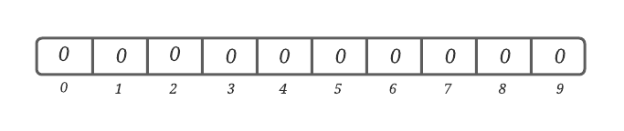
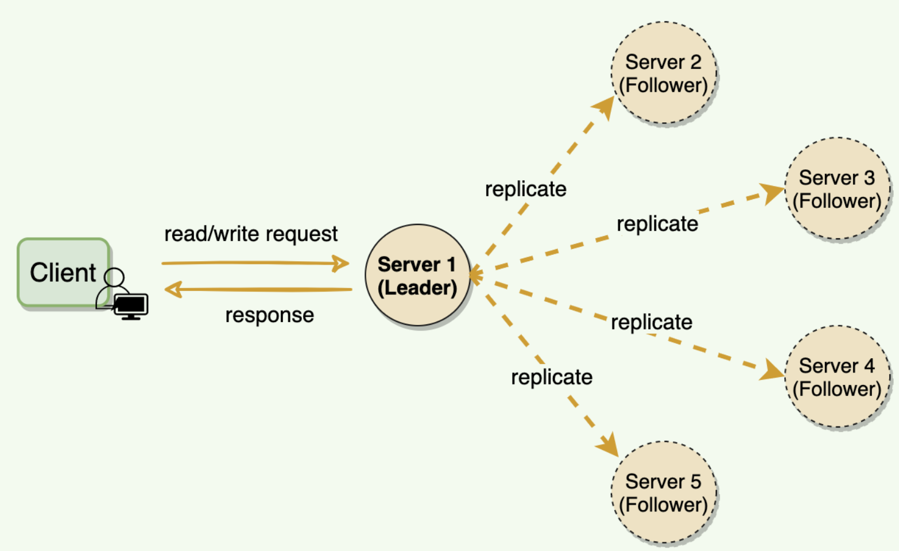

# System Design
This is a high-level overview of some components which are important for scalable and distributed system design, and some sample 
system design examples.

# Table of Content 
- [Selected System Designs](./solutions/README.md)
    - [Design a chat messenger, like Facebook chat or Whatsapp](./solutions/CHAT_MESSENGER_DESIGN.md)
    - [Design a code deployment system](./solutions/Code_Deployment_System.md)
- Important keywords/methods/process
  - [Load Balancing](#load-balancing)
    - [Dynamic load balancing algorithms](#dynamic-load-balancing-algorithms)
    - [Static load balancing algorithms](#static-load-balancing-algorithms)x
    - Load balancing based on layers
  - [Caching](#caching)
  - [Data Partitioning](#data-partitioning)
    - [Partitioning criteria](#partitioning-criteria)
    - [Partitioning Strategies](#partitioning-strategies)
  - [Index Table](#index-table)
  - [Proxies](#proxies)
  - [API Gateway](#api-gateway)
  - [Hashing](./Hashing.md)
  - [Consistent Hashing](./ConsistentHashing.md)
  - [CAP Theorem](./CAP-Theorem.md)
  - [PACELC Theorem](./PACELC-Theorem.md)
  - [Replication](./Replication.md)
  - Fault Tolerance
  - Long-Polling
  - WebSocket
  - [Bloom filter](#bloom-filter)
  - [Quorum](#quorum)
  - [Sloppy Quorum](#sloppy-quorum)
  - [Leader and Follower](#leader-and-follower)
  - [Heartbeat](#heartbeat)
  - [Checksum](#checksum)
  - [Write-Ahead-Log](#write-ahead-log)
  - [Segmented Log](#segmented-log)
  - [HyperLogLog](#hyperloglog)
  - [High-Water Mark](#high-water-mark)
  - [Lease](#lease)
  - Gossip Protocol
  - Phi Accrual Failure Detection
  - Split Brain
  - Fencing 
  - Vector Clocks 
  - Hinted Handoff 
  - Read Repair 
  - Merkle Trees
  - Metadata
  - Compaction 
  - SSL passthrough / termination on load balancers 
  - Two phase commit 
  - Two phase locking 
  - Total order broadcast 
  - Isolation levels (read uncomitted, read comitted, repeatable read, serializable)
  - Quadtree (GeoHashin)
  - Inverse indexing - Google search/any search indexing 
  - Gaming ranking - rank players based on score and faster. 
  - Consistent Core
  - Paxos algo 
  - Raft 
  - Backpressure 
  - Circuit breaker
  - Service discovery 
  - Saga
  - Frugal Streaming - https://github.com/resumejob/system-design-algorithms
  - Geohash / S2 Geometry
  - Leaky bucket / Token bucket
  - Lossy Counting 
  - Operational transformation
  - Ray casting 
  - Reverse index 
  - Rsync algorithm 
  - Trie algorithm 
  - Fenwick Tree
- [System organization](./SystemOrganization.md)

## Load Balancing
Load Balancers are designed to share the load between available resources that serves the load.
Load Balancers distributes/shares/spread incoming traffic across a cluster of resources to improve 
responsiveness and availability. 

Load balancers maintains state/status of all the resources while distributing requests. If any resource 
is not responding or takes more time than usual the Load balancer increase the error rate 
of that specific resource and reduce traffic forwarding to that resource.

[More on Load Balancing](./LoadBalancing.md)

## Caching
Caching is a technique that stores a copy of frequently used data to fast storage that's located close to the application.
Caching is used to improve performance and scalability of a system.

Caching is most efficient for read heavy information, especially if all the following condition apply to the original data store
- data is relatively static, means update is not that frequent
- Reading data from original storage is slower than reading from caching store
- It's subject to a high level of contention
- It's far away when network latency can cause access to be slow

[More on Caching](./Caching.md)

## Data Partitioning
In many large-scale solutions, data is divided into partitions that can be managed and accessed separately. 
Partitioning can improve scalability, reduce contention, and optimize performance. It can also provide a 
mechanism for dividing data by usage pattern. For example, you can archive older data in cheaper data storage.

There are two mostly used partitioning methods, Horizontal Partitioning and Vertical Partitioning. 
***Why partition data?***
- **Improve scalability:** \
   When scaling up a single database system, it will eventually reach a physical hardware limit. If you 
   divide data across multiple partitions, each hosted on a separate server, you can scale out the system almost indefinitely. 
- **Improve performance:** \
  Data access operations on each partition take place over a smaller volume of data. Correctly done, partitioning can make your system more efficient. Operations that affect more than one partition can run in parallel. 
- **Improve security:** \ 
  In some cases, you can separate sensitive and nonsensitive data into different partitions and apply different security controls to the sensitive data. 
- **Provide operational flexibility:** \
  Partitioning offers many opportunities for fine-tuning operations, maximizing administrative efficiency, and minimizing cost. For example, you can define different strategies for management, monitoring, backup and restore, and other administrative tasks based on the importance of the data in each partition. 
- **Match the data store to the pattern of use:** \
  Partitioning allows each partition to be deployed on a different type of data store, based on cost and the built-in features that data store offers. For example, large binary data can be stored in blob storage, while more structured data can be held in a document database. See Choose the right data store. 
- **Improve availability:** \
  Separating data across multiple servers avoids a single point of failure. If one instance fails, only the data in that partition is unavailable. Operations on other partitions can continue. For managed PaaS data stores, this consideration is less relevant, because these services are designed with built-in redundancy.

[More on Data Partitioning](./DataPartitioning.md)

### Index Table
Indexing is a way to optimize the performance of a database by minimizing the number of disk accesses required when a query is processed. 
It is a data structure technique which is used to quickly locate and access the data in a database. 

Indexes are created using some database columns. 
- The first column is the Search key that contains a copy of the primary key or candidate key of the table.
- The second column is the Data Reference which contains a set of pointers holding the address of the disk block where that particular key value can be found.

[More on Index Table](./IndexTable.md)

### Bloom filter
Bloom filter is a space-efficient probabilistic data structure, that is used to test whether an element is a member of a set.
Another way we can say that Bloom filter is used to quickly find if an element might be present in a set.

False positive matches are possible, but false negatives are not – in other words, a query returns either "possibly in set" 
or "definitely not in set". Elements can be added to the set, but not removed (though this can be addressed with the 
counting Bloom filter variant); the more items added, the larger the probability of false positives.

An empty Bloom filter is a bit-array of _m_ bits, all set to _0_. 
There are also _k_ different hash functions, each of which maps a set element to one of the _m_ bit positions.

[More on Bloom filter](./BloomFilter.md)

### Quorum
A quorum is the minimum number of votes that a distributed transaction has to obtain in order to be allowed to perform an operation in a distributed system. 
A quorum-based technique is implemented to enforce consistent operation in a distributed system.

In a distributed database system, a transaction could execute its operations at multiple sites. 
Since atomicity requires every distributed transaction to be atomic, the transaction must have the same fate (commit or abort) at every site. 
In case of network partitioning, sites are partitioned and the partitions may not be able to communicate with each other. 
This is where a quorum-based technique comes in. The fundamental idea is that a transaction is executed if the majority of sites vote to execute it.

[More on Quorum](./Quorum.md)

# Sloppy Quorum 
Sloppy quorums are particularly useful for increasing write availability: as long as any w nodes are available, the database can accept writes. However, this means that even when _w + r > n_, 
you cannot be sure to read the latest value for a key, because the latest value may have been temporarily written to some nodes outside of _n_.

Dynamo replicates writes to a sloppy quorum of other nodes in the system, instead of a strict majority quorum like Paxos. 
All read/write operations are performed on the first _N_ healthy nodes from the preference list, which may not always be the first _N_ nodes encountered while walking the consistent hashing ring.

# Leader and Follower
Distributed systems keep multiple copies of data for fault tolerance and higher availability. A system can use quorum to ensure data consistency between replicas, 
i.e., all reads and writes are not considered successful until a majority of nodes participate in the operation.

However, using quorum can lead to another problem, that is, lower availability; at any time, the system needs 
to ensure that at least a majority of replicas are up and available, otherwise the operation will fail. 
Quorum is also not sufficient, as in certain failure scenarios, the client can still see inconsistent data.
Allow only a single server (called leader) to be responsible for data replication and to coordinate work.

At any time, one server is elected as the **_leader_**. This **_leader_** becomes responsible for data replication 
and can act as the central point for all coordination. The followers only accept writes from the leader and serve as a backup. 
In case the leader fails, one of the followers can become the leader. In some cases, the follower can serve read requests for load balancing.

Examples
- In **_Kafka_**, each partition has a designated leader which is responsible for all reads and writes for that partition. 
Each follower’s responsibility is to replicate the leader’s data to serve as a “backup” partition. This provides 
redundancy of messages in a partition, so that a follower can take over the leadership if the leader goes down.
- Within the Kafka cluster, one broker is elected as the Controller. This Controller is responsible for 
admin operations, such as creating/deleting a topic, adding partitions, assigning leaders to partitions, 
monitoring broker failures, etc. Furthermore, the Controller periodically checks the health of other brokers in the system.
- To ensure strong consistency, Paxos (hence Chubby) performs leader election at startup. This leader is 
responsible for data replication and coordination. 

For leader election, **_Chubby_** uses _Paxos_, which use quorum to ensure strong consistency.

### Heartbeat
A heartbeat protocol is generally used to negotiate and monitor the availability of a resource, such as a floating IP address, and the procedure involves sending network packets to all the nodes in the cluster to verify its reachability.
Typically when a heartbeat starts on a machine, it will perform an election process with other machines on the heartbeat network to determine which machine, if any, owns the resource.

The heartbeat mechanism monitors the connection between a manager and an agent and automates the cleanup procedure when the connection is lost. This enables both the manager and the agent to release resources that were allocated for maintaining the connection.

Each server periodically sends a heartbeat message to a central monitoring server or other servers in the system to show that it is still alive and functioning.

Heartbeating is one of the mechanisms for detecting failures in a distributed system. If there is a central server, all servers periodically send a heartbeat message to it. If there is no central server, 
all servers randomly choose a set of servers and send them a heartbeat message every few seconds. This way, if no heartbeat message is received from a server for a while, the system can suspect that the server might have crashed. 
If there is no heartbeat within a configured timeout period, the system can conclude that the server is not alive anymore and stop sending requests to it and start working on its replacement.

Examples#
- GFS: The leader periodically communicates with each ChunkServer in HeartBeat messages to give instructions and collect state.
- HDFS: The NameNode keeps track of DataNodes through a heartbeat mechanism. Each DataNode sends periodic heartbeat messages (every few seconds) to the NameNode. If a DataNode dies, then the heartbeats to the NameNode are stopped. The NameNode detects that a DataNode has died if the number of missed heartbeat messages reaches a certain threshold. The NameNode then marks the DataNode as dead and will no longer forward any I/O requests to that DataNode.

### Checksum
In a distributed system, while moving data between components, it is possible that the data fetched from a node may arrive corrupted. This corruption can occur because of faults in a storage device, network, software, etc. How can a distributed system ensure data integrity, so that the client receives an error instead of corrupt data?

Calculate a checksum and store it with data.

To calculate a checksum, a cryptographic hash function like MD5, SHA-1, SHA-256, or SHA-512 is used. The hash function takes the input data and produces a string (containing letters and numbers) of fixed length; this string is called the checksum.

When a system is storing some data, it computes a checksum of the data and stores the checksum with the data. When a client retrieves data, it verifies that the data it received from the server matches the checksum stored. If not, then the client can opt to retrieve that data from another replica.

### Write-Ahead-Log
Machines can fail or restart anytime. If a program is in the middle of performing a data modification, 
what will happen when the machine it is running on loses power? When the machine restarts, the program
might need to know the last thing it was doing. Based on its atomicity and durability needs, the program 
might need to decide to redo or undo or finish what it had started. How can the program know what it was 
doing before the system crash?

To guarantee durability and data integrity, each modification to the system is first written to an append-only log on the disk. 
This log is known as Write-Ahead Log (WAL) or transaction log or commit log
Writing to the WAL guarantees that if the machine crashes, the system will be able to recover and reapply the operation if necessary.
The key idea behind the WAL is that all modifications before they are applied to the system are first written to a log file on the disk. 
Each log entry should contain enough information to redo or undo the modification. The log can be read on every restart to recover 
the previous state by replaying all the log entries.

[More on Write-Ahead-Log](./Write-Ahead-Log.md)

### Segmented Log
Segmented Log is a method of maintaining multiple smaller log files instead of a single large file for easier operations.
A single log can become difficult to manage. As the file grows, it can also become a performance bottleneck, especially 
when it is read at the startup. Older logs need to be cleaned up periodically or, in some cases, merged. Doing these 
operations on a single large file is difficult to implement.

[More on Segmented Log](./SegmentedLog.md)

### HyperLogLog
HyperLogLog is an algorithm for the _count-distinct problem_, approximating the number of distinct elements in a multiset. 
Calculating the exact cardinality of a multiset requires an amount of memory proportional to the cardinality, which is 
impractical for very large data sets. For instance, for a set of _8_ numbers, _{4,3,6,2,2,6,1,7}_, the cardinality 
of the membership set would be 6.

The _count-distinct_ problem is the problem of finding the number of distinct elements in a data stream with repeated elements.

[More on HyperLogLog](./HyperLogLog.md)

For More on HyperLogLog read _Philippe Flajolet_ [paper](http://algo.inria.fr/flajolet/Publications/FlFuGaMe07.pdf).

### High-Water Mark
Distributed systems keep multiple copies of data for fault tolerance and higher availability. 
To achieve strong consistency, one of the options is to use a leader-follower setup, where the 
leader is responsible for all the writes, and the followers replicate data from the leader.

Each transaction on the leader is committed to a write-ahead log (WAL), so that the leader can 
recover from crashes or failures. A write request is considered successful as soon as it is 
committed to the WAL on the leader. The replication can happen asynchronously; either the leader 
can push the mutation to the followers, or the follower can pull it from the leader. 
In case the leader crashes and cannot recover, one of the followers will be elected as the new leader. 
**Now, this new leader can be a bit behind the old leader**, as there might be some transactions that 
have not been completely propagated before the old leader crashed. 
We do have these transactions in the WAL on the old leader, but those log entries cannot be recovered until 
the old leader becomes alive again. 
So those transactions are considered lost. Under this scenario, the client can see some data inconsistencies, 
e.g., the last data that the client fetched from the old leader may not be available anymore. 
In such error scenarios, some followers can be missing entries in their logs, and some can have more entries than others. 
So, it becomes important for the leader and followers to know what part of the log is safe to be exposed to the clients.

Keep track of the last log entry on the leader, which has been successfully replicated to a quorum of followers. 
The index of this entry in the log is known as the **High-Water Mark** index. 
The leader exposes data only up to the high-water mark index.

1. For each data mutation, the leader first appends it to WAL and then sends it to all the followers
2. Upon receiving the request, the followers append it to their respective WAL and then send an acknowledgment to the leader
3. The leader keeps track of the indexes of the entries that have been successfully replicated on each follower
4. The high-water mark index is the highest index, which has been replicated on the quorum of the followers
5. The leader can propagate the high-water mark index to all followers as part of the regular Heartbeat message
6. The leader and followers ensure that the client can read data only up to the high-water mark index. 
This guarantees that even if the current leader fails and another leader is elected, the client will not see any data inconsistencies

Examples\
**Kafka**: To deal with non-repeatable reads and ensure data consistency, Kafka brokers keep track of the high-water mark, 
which is the largest offset that all _In-Sync-Replicas (ISRs)_ of a particular partition share. 
Consumers can see messages only until the high-water mark.

# Lease
In distributed systems, a lot of times clients need specified rights to certain resources. 
For example, a client might need exclusive rights to update the contents of a file. 
One way to fulfill this requirement is through distributed locking. 
A client first gets an exclusive (or write) lock associated with the file and then proceeds with updating the file. 
One problem with locking is that the lock is granted until the locking client explicitly releases it. 
If the client fails to release the lock due to any reason, e.g., process crash, deadlock, or a software bug, 
the resource will be locked indefinitely. This leads to resource unavailability until the system is reset. 

An alternate solution:\
Use time-bound leases to grant clients rights on resources.
A lease is like a lock, but it works even when the client goes away. 
The client asks for a lease for a limited period of time, after which the lease expires. 
If the client wants to extend the lease, it can renew the lease before it expires.

Example:\
[Chubby](https://research.google/pubs/pub27897/) clients maintain a time-bound session lease with the leader. During this time interval, 
the leader guarantees to not terminate the session unilaterally.

### Proxies

A proxy server is an intermediate server between the client and the back-end server. 
Clients connect to proxy servers to make a request for a service like a web page, file, connection, etc. 
In short, a proxy server is a piece of software or hardware that acts as an intermediary for requests from clients seeking 
resources from other servers.

Typically, proxies are used to filter requests, log requests, Cache, Batch requests, Collapsed forwarding and Security.

[More on Proxies](./Proxies.md)

### API Gateway
An API gateway is an API management tool that sits between a client and a collection of backend services.

An API gateway is a layer 7 (HTTP) router that acts as a reverse proxy to accept all API calls, aggregate the various services required 
to fulfill them, and return the appropriate result.

With an API gateway, one simply exposes and scales a single collection of services (the API gateway) and updates the API gateway’s 
configuration whenever a new upstream should be exposed externally.

[More on API Gateway](./APIGateway.md)

# Replication
Replication involves sharing information so as to ensure consistency between redundant resources, to improve reliability, fault-tolerance, or accessibility.

Replication in computing can refer to:
- **Data Replication**,  multiple copies of same data is stored and maintained
- **Computation Replication**, the same computing task is executed many times

[More on Replication](./Replication.md)

**Reference**\
The content is mostly by the @author and mixture of contents from [Wikipedia](https://en.wikipedia.org/), [Medium](https://medium.com/), [System Design Primer](https://github.com/donnemartin/system-design-primer), [Microsoft technical documentation](https://docs.microsoft.com/en-ca/) and some random blogs.

[Used references](./References.txt)