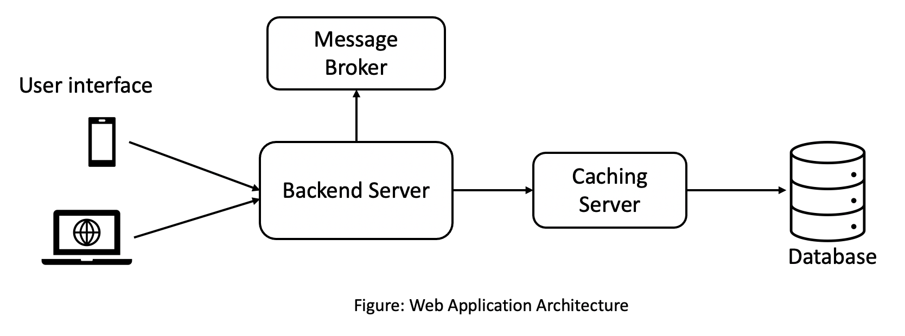
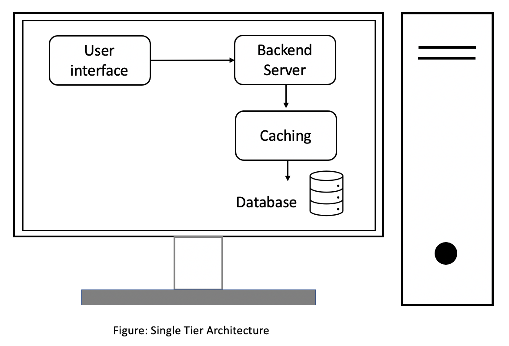
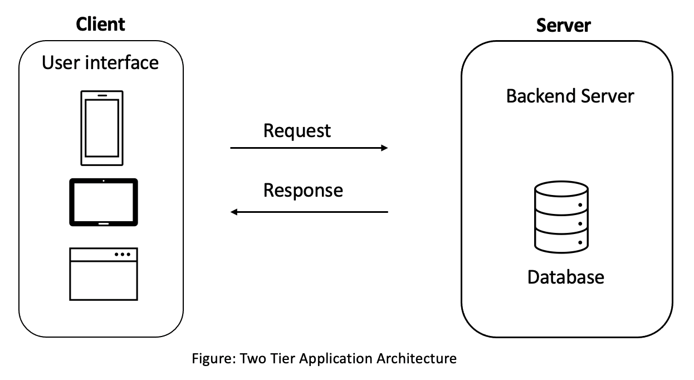
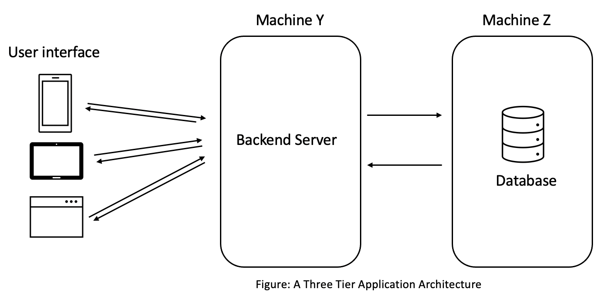

# System Design
This is a high-level overview of some components which are important for scalable and distributed system design, and some sample 
system design examples.

# Table of Content
- [System organization](#system-organization)
  - [Tier base organization](#tier-base-organization)
    - [Single Tier Architecture](#single-tier-architecture)
    - [Two Tier Architecture](#two-tier-architecture)
    - [Three Tier Architecture](#three-tier-architecture)
    - [N-Tier Architecture](#n-tier-architecture)
- [System performance criteria](#)
  - [Scalability](#scalability)
  - [Availability](#availability)
  - [Reliability](#)
  - [Efficiency](#)
  - [Flexibility](#)
  - [Robustness](#)
  - [Maintainability](#)

# System organization
System organization is a set of principles/rules which help to organize a set of sub-systems/modules/components that perform specific tasks/action. 
One of the common is called **Tier** based organization. 
  
## Tier base organization
**Tier** is considered as a logical separation of components in a service or systems. The separation is not at code level; its
physical separation at component level. Here are some components:
- User Interface
- Backend server
- Database server
- Message Broker
- Caching

Here is simple web application architecture

### Single Tier Architecture
In a single tier architecture the entire application (user interface, backend business logic, database) reside in same machine. 
This was one of the common architecture when networking was not easy and cheap.

**Advantages**
- No network latency since every component is located on the same machine. This increases the performance of the software. 
- Data safety, the data stays in a single machine and doesn’t need to be transmitted over a network.
- Performance depends on how powerful the machine is and the hardware requirements of the software.

**Disadvantages**
- Business has no control over the application. After the shipment of the software, no code or features changes can possibly be done until the customer manually updates it by connecting to the remote server or by downloading & installing a patch.
- Performance may degrade over the time if data storage is full or too much content. In this case machine needs to be upgraded.

### Two Tier Architecture
In a *Two-tier* application software components are divided in two terms: a *client* and a *server*. 
The client would contain the user interface and the business logic in one machine. 
And the backend server would be the database running on a different machine. 
The database server is hosted by the business & has control over it.

**Advantages**
- Compare to *Single Tier*, Two Tier is more secure and better control over the system.
    - By separating the public (user-facing) network and the private (data center) network, it provides security by hiding the data center information.
- Data is not in the same machine. Hence, there is no possibility of losing data or corrupting data because of clients action in their machine. 

**Disadvantages**
- Still, some business logic or configuration is in the clients machine. Consider an example of changeing database server address/ip or adding new or secondary database. 
    User interface won't know about this change until there is a patch to update. 

### Three Tier Architecture
*Three Tier* application architecture is one of the most popular architecture and largely used in the industry.

In a *three-tier* application, the *user interface*, *application logic* & the *database* all reside on different machines and thus have different tiers. 
They are physically separated.

**Advantages** 
- First of all isolation and independence. Due to physical separation of components in different machines, each component has its own state in-terms of active, running, not available, internal data. 
  - Consider there is a change in Database, in three-tier architecture you only have to update database layer, don't need to touch user interface and backend server. But with single and two tier you have to touch those ones as well.
- In terms of code change or feature upgrade  or new feature, it is possible to make parallel changes.
- Increases scalability. Now it is possible to scale each layer (user interface, backend server and database) independently. 

**Disadvantages** 
- More network calls between user interface, backend server and database which will increase latency.
                                                                                                    

### N-Tier Architecture
In an *N-tier* architecture there are more than three components involve. Here are some common components:

- Cache
- Message queues for asynchronous behaviour
- Load balancers
- Search servers for searching through massive amounts of data
- Components involved in processing massive amounts of data
- Components running heterogeneous tech commonly known as web services etc.

**Importance of N-Tier**
The importance lie in two software design principles: *Single Responsibility Principle* & the *Separation of Concerns*.\

**Single Responsibility Principle**: 
Single Responsibility Principle simply means giving one, just one responsibility to a component & letting it execute it with perfection. 
Be it saving data, running the application logic or ensuring the delivery of the messages throughout the system.\
This approach gives us a lot of flexibility & makes management easier.

**Separation Of Concerns**: 
Separation of concerns kind of means the same thing, be concerned about your work only & stop worrying about the rest of the stuff.
These principles act at all the levels of the service, be it at the tier level or the code level.

- Keeping the components separate makes them reusable. Different services can use the same database, 
the messaging server or any component as long as they are not tightly coupled with each other.
- Having loosely coupled components is the way to go. The approach makes scaling the service 
easy in future when things grow beyond a certain level.

##  System performance criteria

### Scalability
Scalability means the ability of the application to handle & withstand increased workload without sacrificing the latency.

For instance, if an application takes *n* seconds to respond to a user request. It should take the same *n* seconds to respond to each of 
the million concurrent user requests on that application.

The infrastructure shold not crumble with increasing load or concurrent request. A scalable system each component should
scale when there are more load which can't be handled with existing applications and should maintain the latency of the system.

**Latency** is the amount of time a system takes to respond to a user request. \
Let’s say sending a request to an app to fetch an image & the system takes 2 seconds to respond to the request. The latency of the system is 2 seconds.
 

### Availability

