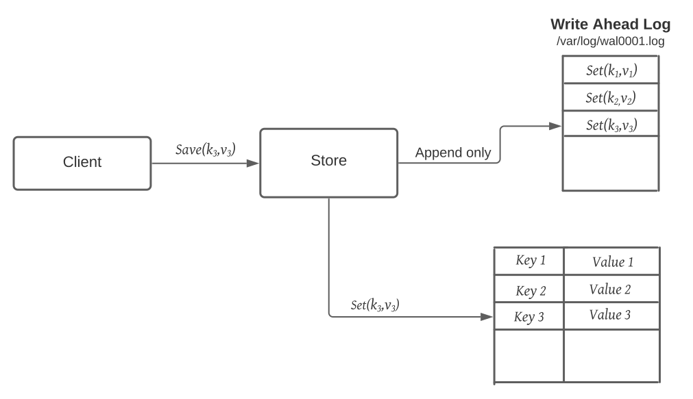

# System Design
This is a high-level overview of some components which are important for scalable and distributed system design, and some sample 
system design examples.

# Table of Content 
- [Selected System Designs](./solutions/README.md)
    - [Design a chat messenger, like Facebook chat or Whatsapp](./solutions/CHAT_MESSENGER_DESIGN.md)
    - [Design a code deployment system](./solutions/Code_Deployment_System.md)
- Important keywords/methods/process
  - [Load Balancing](#load-balancing)
    - [Dynamic load balancing algorithms](#dynamic-load-balancing-algorithms)
    - [Static load balancing algorithms](#static-load-balancing-algorithms)
    - Load balancing based on layers
  - [Caching](#caching)
  - [Data Partitioning](#data-partitioning)
    - [Partitioning criteria](#partitioning-criteria)
    - [Partitioning Strategies](#partitioning-strategies)
  - [Index Table](#index-table)
  - [Proxies](#proxies)
  - Replication 
  - Fault Tolerance
  - CAP Theorem
  - PACELC Theorem
  - [Hashing](./Hashing.md)
  - Consistent Hashing
  - Long-Polling
  - WebSocket
  - Bloom filter
  - Quorum
  - Leader & Follower
  - Heartbeat
  - Checksum
  - [Write-Ahead-Log](#write-ahead-log)
  - Segmented Log
  - Hyperloglog
  - High-Water Mark
  - Lease
  - Gossip Protocol
  - Phi Accrual Failure Detection
  - Split Brain
  - Fencing 
  - Vector Clocks 
  - Hinted Handoff 
  - Read Repair 
  - Merkle Trees
  - Metadata
  - Compaction 
  - SSL passthrough / termination on load balancers 
  - Two phase commit 
  - Two phase locking 
  - Total order broadcast 
  - Isolation levels (read uncomitted, read comitted, repeatable read, serializable)
  - Quadtree (GeoHashin)
  - Inverse indexing - Google search/any search indexing 
  - Gaming ranking - rank players based on score and faster. 
  - Paxos algo 
  - Raft 
  - Backpressure 
  - Circuit breaker
  - Service discovery 
  - Saga
  - Frugal Streaming - https://github.com/resumejob/system-design-algorithms
  - Geohash / S2 Geometry
  - Leaky bucket / Token bucket
  - Lossy Counting 
  - Operational transformation
  - Ray casting 
  - Reverse index 
  - Rsync algorithm 
  - Trie algorithm 
  - Fenwick Tree
- [System organization](./SystemOrganization.md)


## Load Balancing
Load Balancers are designed to share the load between available resources that serves the load.
Load Balancers distributes/shares/spread incoming traffic across a cluster of resources to improve 
responsiveness and availability. 

Load balancers maintains state/status of all the resources while distributing requests. If any resource 
is not responding or takes more time than usual the Load balancer increase the error rate 
of that specific resource and reduce traffic forwarding to that resource. Load balance can be 
used between any two points where we need to share the load. Here is an example of load balancer.


Load balancing algorithms are primarily divided in two types: 
- *Dynamic load balancing* algorithms maintains current state of the resources and distribute traffic accordingly.
- *Static load balancing* algorithms distributes traffic based on a fixed/static schema/plan. 

#### Static load balancing algorithms
1) ***Round Robin***:\
Round robin algorithm cycles through a list of servers and sends each new request to the next server. 
When it reaches the end of the list, it starts over at the beginning. It is most useful when the servers are of equal 
specification and there are not many persistent connections.
2) ***Weighted Round Robin***:\
This algorithms allows weights associated with each resource. Like servers deemed able to handle more traffic 
will receive slightly more. Weighting can be configured within DNS records.
3) ***IP hash***:\
Combines incoming traffic's source and destination IP addresses and uses a mathematical function to convert it into a hash. 
Based on the hash, the connection is assigned to a specific server.

#### Dynamic load balancing algorithms
1) ***Least Connection***:\ 
This algorithm directs traffic to the server with the fewest active connections. This approach is quite useful 
when there are a large number of persistent client connections which are unevenly distributed between the servers.
2) ***Weighted Least Connection***\
Weighted Least Connection is build on the least connection. This algorithm provides administrators the ability to 
assign different weights to each server, assuming that some servers can handle more connections than others.
3) ***Weighted Response Time***:\
Weighted Response Time is a load balancing algorithm where the response times of the application 
servers determines which application server receives the next request. The application server response time 
to a health check is used to calculate the application server weights. The application server that is 
responding the fastest receives the next request.
4) ***Resource-based***:\
Distributes load based on what resources each server has available at the time. Specialized software, called an "agent", 
running on each server measures that server's available CPU and memory, and the load balancer queries the agent 
before distributing traffic to that server.


Load balancer is also a place of single point of failure, So the idea is to use more than one 
load balancers. Now consider like your load balancers are in `one physical unit`, 
`one physical unit` means load balancers may be in one physical machine/one data center/a cluster of cloud instances/a region.
If that one unit is down due to any reason, like power supply, natural disaster, your load balancers are gone. 

In this case there is a strategy of mapping DNS name with multiple server. If someone hit the your domain
It will try one of the assigned serves to forward the requests. These initial stage of serves are the 
load balancers. Here is an example:


## Caching
Caching is a technique that stores a copy of frequently used data to fast storage that's located close to the application.
Caching is used to improve performance and scalability of a system.

Caching is most efficient for read heavy information, especially if all the following condition apply to the original data store
- data is relatively static, means update is not that frequent
- Reading data from original storage is slower than reading from caching store
- It's subject to a high level of contention
- It's far away when network latency can cause access to be slow


Based on the nature of the application/service architecture there are different ways of caching. In <u>distributed
applications</u> there are two strategies:
1) Private caching: In private caching data is held locally in the machine where the application is running. Mostly used in
   in-memory to store the cache. Expecting the cache data size to be smaller, not highly increasing over time. 
2) Shared caching: In shared caching a common source that can be accessed by multiple processes and machines. 
   Multiple application can read/write to same cache, it's little slower than private caching. Considering the cache store
   is in-memory but there will be some time for network call as the shared cache store is not local to the app machine.


Caching is a temporary storage, it may store data for longer period of time but it is not a persistent service/storage.
So it will be safe to store important data that you can afford to lose in persistent storage.\
For dynamic data, data that changes frequently caching is not that useful. If actual/original data changes too frequently
then either the cache becomes stale/old quickly or the overhead of synchronizing the cache with original data store 
reduces the effectiveness of caching.

**Cache hit:**
A _cache hit_ means the data required to serve request is available in the cache and served from the cache.

**Cache miss:** 
A _cache miss_ means the data required to serve requests is not available in the cache and need to compute/get/retrieve
from original datastore/service/server.


**Do we cache all data ?**
Mostly we don't cache all data of an entity at a time. Means, most frequently used data is cached. Data may loaded in caching
store iteratively, just before or as needed. For example, It doesn't make sence to keep all the message, pictures, posts of a 
social network user in cache, rather store the mostly used information, like, profile picture and other identity related information.

#### Caching strategies
### Cache Aside
In cache aside pattern data is loaded in to cache from data store on demand. This can improve performance and also helps 
to maintain consistency between data held in the cache and data in the underlying data store.

Process:
- On receiving request to serve any data, It first determine whether the data is currently available in the cache.
- If the item is not currently available in cache, read the data from the original data store.
- Store a copy of the item in the cache.

### Write through cache
In _Write through cache_, all the write/update happens in the cache first and then to the orginal data store. 
The cache has a writer component that can write to data store/database.
- The application receives request to write data to data store/database.
- The application writes the data to the cache.
- The cache invokes the writer to write to database as well as update the cache.


### Read through cache
In _Read through cache_ strategy, the cache contains a component that can load or read data from 
original data store/database.

- When the application receives the read request, it asks the cache for data associated with the key.
- If requested data found in the cache, cache hit, then the data is served from the cache.
- If requested data is not available/old/outdated in the cache, cache miss, then the cache invokes the loader 
   that fetches the data from the database, updates the cache, and serves the fetched data.
- The next time there is a read request for the same data, it’s served from the cache.

### Write back cache
This strategy is similar to [Write through cache](#write-through-cache) with the change that 
write to original datastore is not synchronous, cache service writes the data to datastore asynchronously.

- The application send write request to the caching server
- The cache server writes data to the cache, also keep the data in a buffer/queue to write to original database,
- The cache server send an acknowledgement back to the application after writing the data cache and buffer. At this 
point write to original database didn't happen.
- The cache internally maintains a buffer to save the writes.
- The cache asynchronously writes the data from the buffer to the database at a later point in time.

## Data Partitioning
In many large-scale solutions, data is divided into partitions that can be managed and accessed separately. 
Partitioning can improve scalability, reduce contention, and optimize performance. It can also provide a 
mechanism for dividing data by usage pattern. For example, you can archive older data in cheaper data storage.

***Why partition data?***
- **Improve scalability:** \
   When scaling up a single database system, it will eventually reach a physical hardware limit. If you 
   divide data across multiple partitions, each hosted on a separate server, you can scale out the system almost indefinitely. 
- **Improve performance:** \
  Data access operations on each partition take place over a smaller volume of data. Correctly done, partitioning can make your system more efficient. Operations that affect more than one partition can run in parallel. 
- **Improve security:** \ 
  In some cases, you can separate sensitive and nonsensitive data into different partitions and apply different security controls to the sensitive data. 
- **Provide operational flexibility:** \
  Partitioning offers many opportunities for fine-tuning operations, maximizing administrative efficiency, and minimizing cost. For example, you can define different strategies for management, monitoring, backup and restore, and other administrative tasks based on the importance of the data in each partition. 
- **Match the data store to the pattern of use:** \
  Partitioning allows each partition to be deployed on a different type of data store, based on cost and the built-in features that data store offers. For example, large binary data can be stored in blob storage, while more structured data can be held in a document database. See Choose the right data store. 
- **Improve availability:** \
  Separating data across multiple servers avoids a single point of failure. If one instance fails, only the data in that partition is unavailable. Operations on other partitions can continue. For managed PaaS data stores, this consideration is less relevant, because these services are designed with built-in redundancy.

### Partitioning criteria

**Horizontal Partitioning**:\
Horizontal partitioning is also known as **sharding**. In horizontal partitioning a table is divided into multiple smaller tables. 
Each table is a separate data store, and it contains the same number of columns, but fewer rows. 

Partitioning happens based on a key, usually we call it partitioning key or sharding key.

The most important factor is the choice of a sharding key. It can be difficult to change the key after the system is in operation. The key must ensure that data is partitioned to spread the workload as evenly as possible across the shards.

**Vertical partitioning**:\
In Vertical partitioning, some columns are moved to new tables. Each table contains the same number of rows but fewer columns. 

### Partitioning Strategies

There are five fundamental data distribution methods as basic partitioning strategies that control how data is placed into individual partitions:
1) Range Partitioning
2) Hash Partitioning
3) List Partitioning
4) Round-robin Partitioning
5) Composite Partitioning

**Range partitioning**:\
In Range partitioning, partitioning key mapped with the range which is available for partitioning. 
An example could be a partition for all rows where the "zipcode" column has a value between 70000 and 79999. 
It distributes tuples based on the value intervals (ranges) of some attribute. In addition to supporting 
exact-match queries (as in hashing), it is well-suited for range queries.
```python
key range       | partition
0 to 1000       | 1
1001 to 2000    | 2
2001 to 3000    | 3
```

**Hash partitioning**:\
Hash partitioning maps data to partitions based on a hashing algorithm to the partitioning key that you identify. 
The hashing algorithm evenly distributes rows among partitions, giving partitions approximately the same size.

Let's have en example,
For a given address we want to partition addresses based on the city. Here the partitioning key is city value.
There will be a hash function which will make sure the hash function will generate same hash value for same city.
Each hash value will have a mapping to a partition.

```python
address                     | hash          | hash value    | partition
222 John street, Toronto    | hash(Toronto) | -----23exzy   | 1
192 Sunset ave, Windsor     | hash(Windsor) | -----abc123   | 2
123 Abc Ave, Toronto        | hash(Toronto) | -----23exzy   | 1
192 XYZ Street, Windsor     | hash(Windsor) | -----abc123   | 2
```

**List Partitioning**:\
In List partitioning each partition is assigned a list of values. If the partition key has one of these values, 
the partition is chosen. Let's have an example, for the address customers, the address with that contains all the 
cities of a province, say cities of Ontario, will be in one partition and addresses that contains any city of Quebec 
will be in a different partition.

```python
Partition 1: [Barrie, Brampton, Hamilton, East York]
Partition 2: [Alma, Blainville, Boucherville, Brossard]

Address                                 | City          |  Partition
150 Manning Ave, Hamilton, ON L9A3E9    | Hamilton      |  Partition 1
99 Rue Gilles, Blainville, QC J7C3A6    | Blainville    |  Partition 2
445 Heath St E, East York, ON M4G1B6    | East York     |  Partition 1
398-250 Rue Boivin, Alma, QC G8B1Y2     | Alma          |  Partition 2 
```

**Round-robin partitioning**:\ 
Round-robin partitioning ensures uniform data distribution. With _n_ partitions, the _i-th_ tuple in insertion order is assigned to partition (_i mod n_). 
Unlike hash partitioning, it doesn't have partitioning columns.
This strategy enables the sequential access to a relation to be done in parallel. 
However, the direct access to individual tuples, based on a predicate, requires accessing the entire relation.

Let's  have a database with 3 nodes

```
Insert request 1: Insert in to node 1
Insert request 2: Insert in to node 2
Insert request 3: Insert in to node 3
Insert request 4: Insert in to node 1
Insert request 5: Insert in to node 2
```


**Composite partitioning**:\
Allows for certain combinations of the above partitioning schemes, by for example first applying 
a range partitioning and then a hash partitioning. Consistent hashing could be considered a composite 
of hash and list partitioning where the hash reduces the key space to a size that can be listed.

There are three partitioning methods:
1) Horizontal Partitioning
2) Vertical Partitioning
3) Directory Based Partitioning

**Horizontal Partitioning**\
In this method a table is divided into multiple smaller tables. Each table is a separate data store, 
and it contains the same number of columns, but fewer rows. Horizontal partitioning is widely used 
so let’s take a closer look.

**Vertical Partitioning**\
Vertical partitioning data is divided in multiple tables with same number of rows but fewer columns.
Generally, this practice is known as normalization. However, vertical partitioning extends further 
and partitions columns even when already normalized.

The most common use for vertical partitioning is to reduce the I/O and performance costs associated 
with fetching items that are frequently accessed

In this example, different properties of an item are stored in different partitions. One 
partition holds data that is accessed more frequently, including product name, description, and price. 
Another partition holds inventory data: the stock count and last-ordered date.


Other advantages of vertical partitioning:
- Relatively slow-moving data (product name, description, and price) can be separated from 
the more dynamic data (stock level and last ordered date). Slow moving data is a good candidate for an application to cache in memory.
- Sensitive data can be stored in a separate partition with additional security controls. 
- Vertical partitioning can reduce the amount of concurrent access that's needed.


**Directory Based Partitioning**:
A loosely coupled approach to work around issues mentioned in the above schemes is to create 
a lookup service which knows your current partitioning scheme and abstracts it away from the DB access code. 
So, to find out where a particular data entity resides, we query the directory server that 
holds the mapping between each tuple key to its DB server. This loosely coupled approach means we can 
perform tasks like adding servers to the DB pool or changing our partitioning scheme without 
having an impact on the application.


**Common Problems of Data Partitioning**:
On a partitioned database, there are certain extra constraints on the different operations 
that can be performed. Most of these constraints are due to the fact that operations across multiple tables or 
multiple rows in the same table will no longer run on the same server. Below are some of the constraints 
and additional complexities introduced by partitioning:

1) **Joins and Denormalization:**\
Performing joins on a database which is running on one server is straightforward, but once a database is partitioned and spread across multiple machines it is often not feasible to perform joins that span database partitions. Such joins will not be performance efficient since data has to be compiled from multiple servers. A common workaround for this problem is to denormalize the database so that queries that previously required joins can be performed from a single table. Of course, the service now has to deal with all the perils of denormalization such as data inconsistency.

2) **Referential integrity:**\
As we saw that performing a cross-partition query on a partitioned database is not feasible, similarly, trying to enforce data integrity constraints such as foreign keys in a partitioned database can be extremely difficult.\
    Most of RDBMS do not support foreign keys constraints across databases on different database servers. Which means that applications that require referential integrity on partitioned databases often have to enforce it in application code. Often in such cases, applications have to run regular SQL jobs to clean up dangling references.

3) **Rebalancing:**\
There could be many reasons we have to change our partitioning scheme:

The data distribution is not uniform, e.g., there are a lot of places for a particular ZIP code that cannot fit into one database partition.
There is a lot of load on a partition, e.g., there are too many requests being handled by the DB partition dedicated to user photos.
In such cases, either we have to create more DB partitions or have to rebalance existing partitions, which means the partitioning scheme changed and all existing data moved to new locations. Doing this without incurring downtime is extremely difficult. Using a scheme like directory based partitioning does make rebalancing a more palatable experience at the cost of increasing the complexity of the system and creating a new single point of failure (i.e. the lookup service/database).


### Index Table
Indexing is a way to optimize the performance of a database by minimizing the number of disk accesses required when a query is processed. 
It is a data structure technique which is used to quickly locate and access the data in a database. 

Indexes are created using some database columns. 
- The first column is the Search key that contains a copy of the primary key or candidate key of the table.
- The second column is the Data Reference which contains a set of pointers holding the address of the disk block where that particular key value can be found.


In general, there are two types of file organization mechanism which are followed 
by the indexing methods to store the data:  
1. Sequential File Organization or Ordered Index File: \
   In this, the indices are based on a sorted ordering of the values. These are generally fast and a more traditional type of storing mechanism. These Ordered or Sequential file organization might store the data in a dense or sparse format: 
   - Dense Index: 
     - For every search key value in the data file, there is an index record. 
     - This record contains the search key and also a reference to the first data record with that search key value.
   - Sparse Index:
     - The index record appears only for a few items in the data file. Each item points to a block as shown. 
     - To locate a record, we find the index record with the largest search key value less than or equal to the search key value we are looking for. 
     - We start at that record pointed to by the index record, and proceed along with the pointers in the file (that is, sequentially) until we find the desired record.
   
2. Hash File organization: \
   Indices are based on the values being distributed uniformly across a range of buckets. 
   The buckets to which a value is assigned is determined by a function called a hash function.\
   There are primarily three methods of indexing:
   - Clustered Indexing
   - Non-Clustered or Secondary Indexing
   - Multilevel Indexing
 

Create indexes over the fields in data stores that are frequently referenced by queries.
An index table organizes the data by a specified key.  

Many data stores organize the data for a collection of  entities using the primary key.
While the primary key is valuable for queries that fetch data based on the value 
of this key, an application might not be able to use the primary key if it needs to 
retrieve data based on some other field.


In the above example customer ID is the primary key, if the query needs to get customers based on 
the city then it won't be possible based on the current table. To support that we need a secondary index. 

Many relational database management systems support _secondary indexes_. A _secondary index_ 
is a separate data structure that's organized by one or more non-primary (secondary) key fields, 
and it indicates where the data for each indexed value is stored. 

An application can use this key to locate and retrieve data.

Three strategies are commonly used for structuring an index table
1) Duplicate the data in each index table but organize it by different keys.
2) Create normalized index tables organized by different keys and reference the original data by using the primary key rather than duplicating it.\
   This technique saves space and reduces the overhead of maintaining duplicate data. The disadvantage is that an application has to perform two lookup operations to find data using a secondary key. It has to find the primary key for the data in the index table, and then use the primary key to look up the data in the fact table
3) Create partially normalized index tables organized by different keys that duplicate frequently retrieved fields. Reference the fact table to access less frequently accessed fields.


### Write-Ahead-Log
Machines can fail or restart anytime. If a program is in the middle of performing a data modification, 
what will happen when the machine it is running on loses power? When the machine restarts, the program
might need to know the last thing it was doing. Based on its atomicity and durability needs, the program 
might need to decide to redo or undo or finish what it had started. How can the program know what it was 
doing before the system crash?

To guarantee durability and data integrity, each modification to the system is first written to an append-only log on the disk. 
This log is known as Write-Ahead Log (WAL) or transaction log or commit log
Writing to the WAL guarantees that if the machine crashes, the system will be able to recover and reapply the operation if necessary.
The key idea behind the WAL is that all modifications before they are applied to the system are first written to a log file on the disk. 
Each log entry should contain enough information to redo or undo the modification. The log can be read on every restart to recover 
the previous state by replaying all the log entries.


Examples
- The log implementation in all Consensus algorithms like Zookeeper and RAFT is similar to write ahead log
- **Cassandra**: To ensure durability, whenever a node receives a write request, it immediately writes the data to a commit log which is a WAL. Cassandra, before writing data to a MemTable, first writes it to the commit log. This provides durability in the case of an unexpected shutdown. On startup, any mutations in the commit log will be applied to MemTables.
- **Kafka**: implements a distributed Commit Log to persistently store all messages it receives.
- **Chubby**: For fault tolerance and in the event of a leader crash, all database transactions are stored in a transaction log which is a WAL.


###  


**Reference**\
The content is mostly by the @author and mixture of contents from [Wikipedia](https://en.wikipedia.org/), [Medium](https://medium.com/), [System Design Primer](https://github.com/donnemartin/system-design-primer), [Microsoft technical documentation](https://docs.microsoft.com/en-ca/) and some random blogs.
