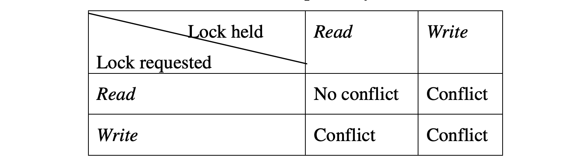

# Replication
Replication involves sharing information so as to ensure consistency between redundant resources, to improve reliability, fault-tolerance, or accessibility.

Replication in computing can refer to:
- **Data Replication**
- **Computation Replication**

In **_Data Replication_** multiple copies of same data is stored and maintained, usually stored in different location.

In **_Computation Replication_** the same computing task is executed many times. Computational tasks may be:
- _Replicated in space_, where tasks are executed on separate devices
- _Replicated in time_, where tasks are executed repeatedly on a single device

Replication in space or in time is often linked to scheduling algorithms

Computer scientists further describe replication as being either:
- **_Active replication_**, which is performed by processing the same request at every replica
- **_Passive replication_**, which involves processing every request on a single replica and transferring the result to the other replicas

**_Active replication_** also called the state machine approach, is a non-centralised replication technique. Its
key concept is that all replicas receive and process the same sequence of client requests. Consistency is guaranteed by
assuming that, when provided with the same input in the same order, replicas will produce the same output. This
assumption implies that servers process requests in a deterministic way.
The main advantage of active replication is its simplicity (e.g., same code everywhere) and failure transparency.

Failures are fully hidden from the clients, since if a replica fails, the requests are still processed by the other replicas.

**_Passive replication_**
The basic principle of passive replication, also called Primary Backup replication, is that clients send their requests to a primary, 
which executes the requests and sends update messages to the backups (see Figure 3). The backups do not execute the invocation, 
but apply the changes produced by the invocation execution at the primary (i.e., updates). By doing this, no determinism constraint 
is necessary on the execution of invocations.

Communication between the primary and the backups has to guarantee that updates are received and then processed in the 
same order, which is the case if primary backup communication is based on FIFO channels. However, FIFO channels are 
not enough to ensure correct execution in case of failure of the primary. For example, consider
that the primary fails before all backups receive the updates for a certain request, and another replica takes over as a new
primary. Some mechanism has to ensure that updates sent by the new primary will be “properly” ordered with regard
to the updates sent by the faulty primary. VSCAST is a mechanism that guarantees these constraints, and can usually be used to implement the primary backup replication
technique.

Passive replication can tolerate non-deterministic servers (e.g., multi-threaded servers) and uses little processing
power when compared to other replication techniques. However, passive replication suffers from a high reconfiguration cost when the primary fails. The five steps of our
framework are the following:
1. The client sends the request to the primary.
2. There is no initial coordination.
3. The primary executes the request.
4. The primary coordinates with the other replicas by sending the update information to the backups.
5. The primary sends the answer to the client.

## Replication Protocols
1. ROWA and ROWA-Available, Read-One-Write-All
2. Quorum Based

### ROWA and ROWA-Available
In most cases, the system is aware of which data items have replicas and where are they located.
A replica control protocol is required to read and write replicated data items. The most simple
replica control protocol is the **_Read-One-Write-All (ROWA)_** protocol. 

In _ROWA_ protocol, a transaction requests to read an item and the system fetches the value from the most convenient
location. If a write operation is requested, the system must update all the replicas. 

It is clearly evident that the read operation benefits from data replication, as it can find a replica near the site
of request. But, write operations may adversely affect the performance of the system. A very obvious alternative of 
_ROWA_ protocol is _ROWA-Available_. _ROWA-A_ was proposed to provide more flexibility to _ROWA_ algorithm in presence of failures. 
Read operation of ROWA-A can be performed similar to ROWA, i.e. on any replicated copy. 
But to provide more flexibility, write operations are performed only on the available copies and it ignores any failed replicas.
ROWA-A solves the availability problem, but the correctness of the data may have been
compromised. After the failed site has recovered, it stores the stale value of the data. Any
transaction reading that replica, reads an out-of-date copy of the replica and thus the resulting
execution is not 1SR

### Quorum Based
An interesting proposal to update only a subset of replicas and still not compromise with
correctness and consistency is based on quorums (Bernstein, 1987). Every copy of the replica is
assigned a non-negative vote (quorum). Read and write threshold are defined for each data item.
The sum of read and write threshold as well as twice of write threshold must be greater than the
total vote assigned to the data. These two conditions ensure that there is always a non-null
intersection between any two quorum sets. The non-null set between read quorum and write
quorum guarantees to have at least one latest copy of the data item in any set of sites. This
avoids the read/write and write/write conflict. The conflict table is as shown in Table

 

All transactions must collect a read/write quorum to read/write any data item. A read/write
quorum of a data is any set of copies of the data with a weight of at least read/write threshold.
Quorum-based protocols maintain the consistency of data in spite of operating only on a subset
of the replicated database.

Detail of majority consensus quorum protocol is shown below:

<i>Q</i> = Total number of votes (maximum quorum) = number of sites in the replicated system (assuming each site has equal weight)\
<i>QR</i> and <i>QW</i> = Read and write quorum respectively

In order to read an item, a transaction must collect a quorum of at least <i>QR</i> votes and in order to
write, it must collect a quorum of <i>QW</i> votes. The overlapping between read and write quorum
makes sure that a reading transaction will at least get one up-to-date copy of the replica. The
quorums must satisfy following two threshold constraints:

(i) <i>QR</i> + <i>QW</i> > Q and\
(ii) <i>QW</i> + <i>QW</i> > Q

Quorum-based replicated system may continue to operate even in the case of site or
communication failure if it is successful in obtaining the quorum for the data item. Thus we see
that main research focus in Distributed DBMS is in maintaining consistency of replicated data. 
