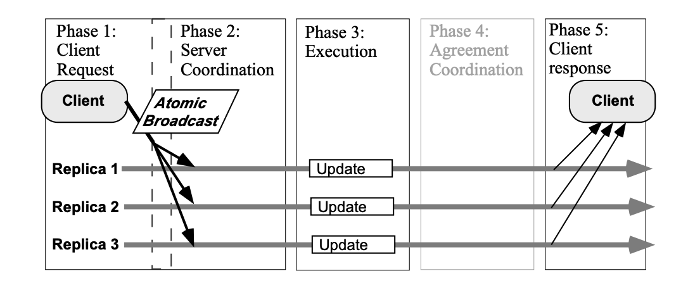
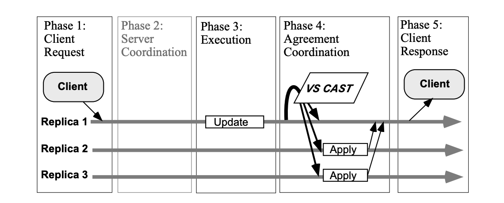
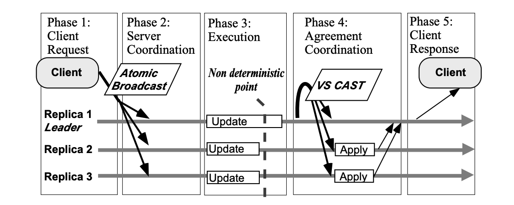

# Replication
Replication involves sharing information so as to ensure consistency between redundant resources, to improve reliability, fault-tolerance, or accessibility.

Replication in computing can refer to:
- **Data Replication**
- **Computation Replication**

In **_Data Replication_** multiple copies of same data is stored and maintained, usually stored in different location.

In **_Computation Replication_** the same computing task is executed many times. Computational tasks may be:
- _Replicated in space_, where tasks are executed on separate devices
- _Replicated in time_, where tasks are executed repeatedly on a single device

Replication in space or in time is often linked to scheduling algorithms

There are several benefits of using this technique:\
- **_Performance enhancement_** - more load (e.g., client requests) can be tolerated because workload is shared among several processes. In addition, latency can be reduced by replicating data closer to the user. Unfortunately, benefits are reduced if data is read/write.
- **_Increased availability_** - replication helps a service to overcome individual server failures. If a server will fail with probability p, the number of servers needed to provide a given level of service is <i>Avail = 1-pn</i>.
- **_Fault tolerance_** - similar to availability, but ensures correctness in addition to availability. For example, if one server of a group of n servers provides bad information, the others can outvote the incorrect server and provide correct data to the client.

Computer scientists further describe replication as being either:
- **_Active replication_**, which is performed by processing the same request at every replica
- **_Passive replication_**, which involves processing every request on a single replica and transferring the result to the other replicas
- **_Semi-Active replication_**

### Active replication
**_Active replication_** also called the state machine approach, is a non-centralised replication technique. Its
key concept is that all replicas receive and process the same sequence of client requests. Consistency is guaranteed by
assuming that, when provided with the same input in the same order, replicas will produce the same output. This
assumption implies that servers process requests in a deterministic way.

Clients do not contact one particular server, but address servers as a group. In order for servers to receive the same
input in the same order, client requests can be propagated to servers using an Atomic Broadcast. Weaker communication
primitives can also be used if semantic information about the operation is known (e.g., two requests that commute do 
not have to be delivered at all servers in the same order)

The main advantage of active replication is its simplicity (e.g., same code everywhere) and failure transparency.

Failures are fully hidden from the clients, since if a replica fails, the requests are still processed by the other replicas.

The determinism constraint is the major drawback of this approach. Although one might also argue that having all
the processing done on all replicas consumes too many resources. Notice however, that the alternative, that is, processing a request at only one replica and transmitting the
state changes to the others (see next section), in some cases may be much more complex and expensive than simply executing the invocation on all sites

Request (RE): the client submits an operation to one (or more) replicas.\
Server coordination (SC): the replica servers coordinate with each other to synchronise the execution of the operation (ordering of concurrent operations).\
Agreement coordination (AC): the replica servers agree on the result of the execution (e.g., to guarantee atomicity).

In active replication, phases **RE** and **SC** are merged and phase **AC** is
not used. The following steps are involved in the processing of an update request in the Active Replication, according to
our functional model.
1. The client sends the request to the servers using an Atomic Broadcast.
2. Server coordination is given by the total order property of the Atomic Broadcast.
3. All replicas execute the request in the order they are delivered.
4. No coordination is necessary, as all replica process the same request in the same order. Because replica are deterministic, they all produce the same results.
5. All replica send back their result to the client, and the client typically only waits for the first answer.

### Passive replication
The basic principle of passive replication, also called Primary Backup replication, is that clients send their requests to a primary, 
which executes the requests and sends update messages to the backups (see Figure 3). The backups do not execute the invocation, 
but apply the changes produced by the invocation execution at the primary (i.e., updates). By doing this, no determinism constraint 
is necessary on the execution of invocations.

Communication between the primary and the backups has to guarantee that updates are received and then processed in the 
same order, which is the case if primary backup communication is based on FIFO channels. However, FIFO channels are 
not enough to ensure correct execution in case of failure of the primary. For example, consider
that the primary fails before all backups receive the updates for a certain request, and another replica takes over as a new
primary. Some mechanism has to ensure that updates sent by the new primary will be “properly” ordered with regard
to the updates sent by the faulty primary. VSCAST is a mechanism that guarantees these constraints, and can usually be used to implement the primary backup replication
technique.

Passive replication can tolerate non-deterministic servers (e.g., multi-threaded servers) and uses little processing
power when compared to other replication techniques. However, passive replication suffers from a high reconfiguration cost when the primary fails. The five steps of our
framework are the following:
1. The client sends the request to the primary.
2. There is no initial coordination.
3. The primary executes the request.
4. The primary coordinates with the other replicas by sending the update information to the backups.
5. The primary sends the answer to the client.

### Semi-Active replication
Semi-active replication is an intermediate solution between active and passive replication. 
Semi-active replication does not require that replicas process service invocation in a deterministic manner.

The main difference between semi-active replication and active replication is that each time replicas have to make
a non-deterministic decision, a process, called the **_leader_**, makes the choice and sends it to the followers. Figure
depicts Semi-active replication. Phases EX and AC are repeated for each non deterministic choice.
The following steps characterise semi-active replication, according to our framework.

1. The client sends the request to the servers using an Atomic Broadcast.
2. The servers coordinate using the order given by this Atomic Broadcast.
3. All replicas execute the request in the order they are delivered.
4. In case of a non deterministic choice, the leader informs the followers using the View Synchronous Broadcast.
5. The servers send back the response to the client.

## Replication Protocols
1. ROWA and ROWA-Available, Read-One-Write-All
2. Quorum Based

### ROWA and ROWA-Available
In most cases, the system is aware of which data items have replicas and where are they located.
A replica control protocol is required to read and write replicated data items. The most simple
replica control protocol is the **_Read-One-Write-All (ROWA)_** protocol. 

In _ROWA_ protocol, a transaction requests to read an item and the system fetches the value from the most convenient
location. If a write operation is requested, the system must update all the replicas. 

It is clearly evident that the read operation benefits from data replication, as it can find a replica near the site
of request. But, write operations may adversely affect the performance of the system. A very obvious alternative of 
_ROWA_ protocol is _ROWA-Available_. _ROWA-A_ was proposed to provide more flexibility to _ROWA_ algorithm in presence of failures. 
Read operation of ROWA-A can be performed similar to ROWA, i.e. on any replicated copy. 
But to provide more flexibility, write operations are performed only on the available copies and it ignores any failed replicas.
ROWA-A solves the availability problem, but the correctness of the data may have been
compromised. After the failed site has recovered, it stores the stale value of the data. Any
transaction reading that replica, reads an out-of-date copy of the replica and thus the resulting
execution is not 1SR

### Quorum Based
An interesting proposal to update only a subset of replicas and still not compromise with
correctness and consistency is based on quorums (Bernstein, 1987). Every copy of the replica is
assigned a non-negative vote (quorum). Read and write threshold are defined for each data item.
The sum of read and write threshold as well as twice of write threshold must be greater than the
total vote assigned to the data. These two conditions ensure that there is always a non-null
intersection between any two quorum sets. The non-null set between read quorum and write
quorum guarantees to have at least one latest copy of the data item in any set of sites. This
avoids the read/write and write/write conflict. The conflict table is as shown in Table

 

All transactions must collect a read/write quorum to read/write any data item. A read/write
quorum of a data is any set of copies of the data with a weight of at least read/write threshold.
Quorum-based protocols maintain the consistency of data in spite of operating only on a subset
of the replicated database.

Detail of majority consensus quorum protocol is shown below:

<i>Q</i> = Total number of votes (maximum quorum) = number of sites in the replicated system (assuming each site has equal weight)\
<i>QR</i> and <i>QW</i> = Read and write quorum respectively

In order to read an item, a transaction must collect a quorum of at least <i>QR</i> votes and in order to
write, it must collect a quorum of <i>QW</i> votes. The overlapping between read and write quorum
makes sure that a reading transaction will at least get one up-to-date copy of the replica. The
quorums must satisfy following two threshold constraints:

(i) <i>QR</i> + <i>QW</i> > Q and\
(ii) <i>QW</i> + <i>QW</i> > Q

Quorum-based replicated system may continue to operate even in the case of site or
communication failure if it is successful in obtaining the quorum for the data item. Thus we see
that main research focus in Distributed DBMS is in maintaining consistency of replicated data. 

## Database Replication Strategies
1. Log-Based Incremental Replication
2. Key-Based Incremental Replication
3. Full Table Replication
4. Snapshot Replication
5. Transactional Replication
6. Merge Replication
7. Bidirectional Replication

#### Log-Based Incremental Replication

Some databases allow you to store transaction logs for a variety of reasons, one of which is for easy recovery in case of a disaster. However, in log-based incremental replication, your replication tool can also look at these logs, identify changes to the data source, and then reproduce the changes in the replica data destination (e.g., database). These changes could be INSERT, UPDATE, or DELETE operations on the source database.

The benefits of this data replication strategy are:

- Because log-based incremental replication only captures row-based changes to the source and updates regularly 
(say, once every hour), there is low latency when replicating these changes in the destination database.
- There is also reduced load on the source because it streams only changes to the tables.
- Since the source consistently stores changes, we can trust that it doesn’t miss vital business transactions.
- With this data replication strategy, you can scale up without worrying about the additional cost of processing bulkier data queries.

Unfortunately, a log-based incremental replication strategy is not without its challenges:

- It’s only applicable to databases, such as MongoDB, MySQL, and PostgreSQL, that support binary log replication.
- Since each of these databases has its own log formats, it’s difficult to build a generic solution that covers 
- all supported databases. 
- In the case where the destination server is down, you have to keep the logs up to date until you restore the server. 
- If not, you lose crucial data.

Despite its challenges, log-based incremental replication is still a valuable data replication strategy because it offers 
fast, secure, and reliable replication for data storage and analytics.

#### Key-Based Incremental Replication
As the name implies, key-based replication involves replicating data through the use of a replication key. The replication key is one 
of the columns in your database table, and it could be an integer, timestamp, float, or ID.

Key-based incremental replication only updates the replica with the changes in the source since the last replication job. During 
data replication, your replication tool gets the maximum value of your replication key column and stores it. During the next 
replication, your tool compares this stored maximum value with the maximum value of your replication key column in your source. 
If the stored maximum value is less than or equal to the source’s maximum value, your replication tool replicates the changes. 
Finally, the source’s maximum value becomes the stored value.

This process is repeated for every replication job that is key-based, continually using the replication key to spot changes in the 
source. This data replication strategy offers similar benefits as log-based data replication but comes with its own limitations:

It doesn’t identify delete operations in the source. When you delete a data entry in your table, you also delete the replication 
key from the source. So the replication tool is unable to capture changes to that entry.
There could be duplicate rows if the records have the same replication key values. This occurs because key-based incremental 
replication also compares values equal to the stored maximum value. So it duplicates the record until it finds another record 
of greater replication key.
In cases where log-based replication is not feasible or supported, key-based replication would be a close alternative. And knowing 
these limitations would help you better tackle data discrepancies where they occur.
