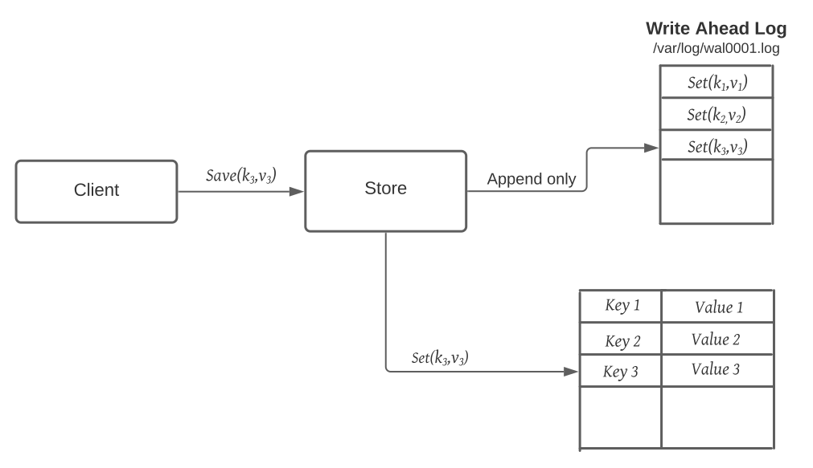

### Write-Ahead-Log
Machines can fail or restart anytime. If a program is in the middle of performing a data modification, 
what will happen when the machine it is running on loses power? When the machine restarts, the program
might need to know the last thing it was doing. Based on its atomicity and durability needs, the program 
might need to decide to redo or undo or finish what it had started. How can the program know what it was 
doing before the system crash?

To guarantee durability and data integrity, each modification to the system is first written to an append-only log on the disk. 
This log is known as Write-Ahead Log (WAL) or transaction log or commit log
Writing to the WAL guarantees that if the machine crashes, the system will be able to recover and reapply the operation if necessary.
The key idea behind the WAL is that all modifications before they are applied to the system are first written to a log file on the disk. 
Each log entry should contain enough information to redo or undo the modification. The log can be read on every restart to recover 
the previous state by replaying all the log entries.

Examples
- The log implementation in all Consensus algorithms like Zookeeper and RAFT is similar to write ahead log
- **Cassandra**: To ensure durability, whenever a node receives a write request, it immediately writes the data to a commit log which is a WAL. Cassandra, before writing data to a MemTable, first writes it to the commit log. This provides durability in the case of an unexpected shutdown. On startup, any mutations in the commit log will be applied to MemTables.
- **Kafka**: implements a distributed Commit Log to persistently store all messages it receives.
- **Chubby**: For fault tolerance and in the event of a leader crash, all database transactions are stored in a transaction log which is a WAL.
