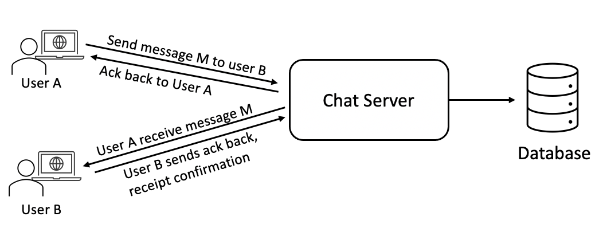
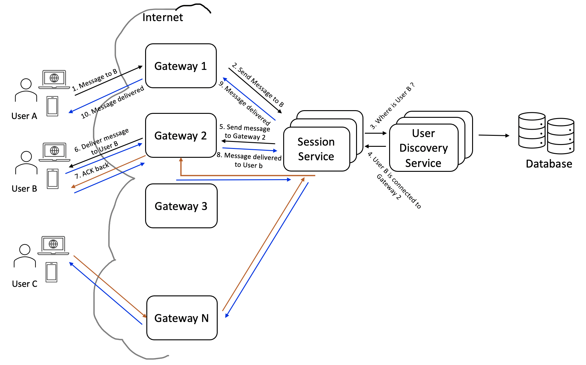

# Design messaging service

### Design a chat messaging service like Facebook/Whatsapp

#### Things to know
* **What is a chat messaging service?**\
    A chat messaging service is a software that provides text, image or mix content messaging service to its user. Basically user A sends message to user B and user B sends message to user A.

### Requirement / Goal / Features
**Functional Requirement**\
The system should support:
* One-to-one messaging
* Group messaging, 
* Message state/status: Sent, Delivered, Read
* User status: online or offline
* Persistent storage of chat history

**Non-Functional requirements:**\ 
* Users should have real time chat experience with the lowest possible latency.
* The system should be highly consistent, user should see the latest messages in all connected devices
* The system should be highly available. 

### Capacity estimation
User size, Daily active user: `500 Million`\
Average message sent by each user: `40 message / day`\
So, total number of messages/day : `500 Million * 40` = `20,000 Million = 20 Billion`\

Write and Read per second = `20 Billion message / 24 * 3600 = 230000 / second` 

**Storage**:\
Average size of each message(without images): `120 byte`\
Storage required each day: `20 Billion message * 120 byte = 2.4 TB/day`\
If we are looking for storing the chat history for 10 years then we will need: `2.4 TB * 30 day * 12 * 10 = ~8600 TB = 8.6 Petabyte`. This estimation is without considering increasing users, average message/day, other metadata information.\

**Bandwidth**\
Network bandwidth will be more for group messaging, for simplicity lets estimate one-to-one messaging.

There are `2.4 TB` data generated each day, so incoming data rate: `2.4 TB / 24 hour * 3600 second = 27 MB/sec.` If each message is sent to one user and read only once then we need to add `27 MB/sec`.

### High Level Design
At the high level we will need a chat server, a microservice, which will be central piece of orchestrating all the communications between users. 

The detailed workflow would look like this:
* User-A sends a message to User-B through the chat server.
* The server receives the message and sends an acknowledgment to User-A.
* The server stores the message in its database and sends the message to User-B.
* User-B receives the message and sends the acknowledgment to the server.
* The server notifies User-A that the message has been delivered successfully to User-B.

### Detailed Component Design
Let's build the solution where all the users are connected to single chat server. First try to answer few questions 
that clarifies the system. 

**How do clients send and receive messages from a chat server?**\
To send a message user needs to connect to the chat server. For sending data to chat server 
user may use HTTP protocol, but receiving data from server there are two options:
- Pull model
- Push model

In `Pull model` user periodically ask server if there is any message for the user, stateless call.
In `Push model` user sends a request to the server for message, server doesn't response until there 
is any message for the user. Server keeps a open connection with the client.

In the `Pull model`, the server needs to keep track of messages that are still waiting to be delivered, 
and as soon as the receiving user connects to the server to ask for any new message, the server can 
return all the pending messages. If client make frequent request to the server, like every second to make 
it look like real-time. A lot of resources get wasted if there is no active communication is not happening. 

In `Push model`, active users keeps a connection open with the server. When server receive any message, it immediately
sends back to the user using previously opened connection. In this approach server doesn't need to keep track of the pending 
messages.

**How will clients maintain an open connection with the server?**\
We can use [HTTP Long Polling](https://en.wikipedia.org/wiki/Push_technology#Long_polling) or [WebSockets](https://en.wikipedia.org/wiki/WebSocket). In long polling, clients can request information from the 
server with the expectation that the server may not respond immediately. If the server has no new data for 
the client when the poll is received, instead of sending an empty response, the server holds the request open 
and waits for response information to become available. Once it does have new information, the server immediately 
sends the response to the client, completing the open request. Upon receipt of the server response, the client can 
immediately issue another server request for future updates. This gives a lot of improvements in latencies, 
throughputs, and performance. However, the long polling request can timeout or receive a disconnect from the server; 
in that case, the client has to open a new request.

For realtime and fast communication [WebSocket](https://en.wikipedia.org/wiki/WebSocket) is preferred.

**How can the server keep track of all the opened connections to efficiently redirect messages to the users?**\
Data structures/Storage like Kay Value pair will do. The server can maintain a hash table, where “key” would be the UserID and 
“value” would be the connection object. So whenever the server receives a message for a user, it looks up that user in 
the hash table to find the connection object and sends the message on the open request. 

**What will happen when the server receives a message for a user who has gone offline?**\
All the messages received by the server get persisted to some database. If recipient is not available the state of the message won't change. 
The state of the message will stay at `sent`, not `delivered`. Server will take some time to decide on the status as it could be a 
temporary disconnect, e.g., the receiver’s long-poll request just timed out, then we should expect a reconnect from 
the user. For WebSocket communication, server will retry few times before updating the message status.

**How many chat servers do we need?**\
With 500 million daily active user for the busiest moment we need to support 500 million connections at any time. 
Assuming a server can handle 50K concurrent connections at any time, we would need 10K such servers.

**How do we know which server holds the connection to which user?**\
We can introduce a getway service in front of our chat servers; that can map each UserID to a server to 
redirect the request.

**How should the server process a ‘deliver message’ request?**\
The server needs to do the following things upon receiving a new message: 
- Store the message in the database
- Send the message to the receiver and 
- Send an acknowledgment to the sender

The chat server will first find the server that holds the connection for the receiver and pass the message to that server to send it to the receiver. 
The chat server can then send the acknowledgment to the sender; we don’t need to wait to store the message in the database (this can happen in the background). Storing the message is discussed in the next section.

Application installed in mobile or web browser connects to a component called `Gateway`, to connect to the messenger system.
The reason of a `Gateway` component is that we will be using an external protocol to connect to the messenger system and the internal 
communication between different components inside the messenger system may differ. Ideally, internal communications are very lightweight, without security concern and don't need big headers in the payload.
In the `Gateway` lot of security mechanism will be placed. 
For large geographic area `Gateway` will have many instances, and instances will be restricted by a list of dedicated areas.   

Users will be connected to different `Gateway`. Let's consider **User A** connected to **Gateway 1** wants to send a message to **User B** who is 
connected to **Gateway 2**.\
1. **User A** send a message to **Gateway 1** \
  
How do **Gateway 1** will know where is **User B** connected to?\
   
   
2. **Session Service**, is a microservice that maintains/holds the information related to which user is connected to which `Gateway`.
The information may be stored in database. There will be multiple instances of **Session Service**. 
Now how do **Session Service** know which user is connected to which `Gateway`? When a user `A` successfully connects to a `Getway G`, the Gateway 
notifies the **Session Service** that user `A` is now connected to `Getway G`. Session service stores the value in key value pair, like **<UserID, GatewayID>**.

